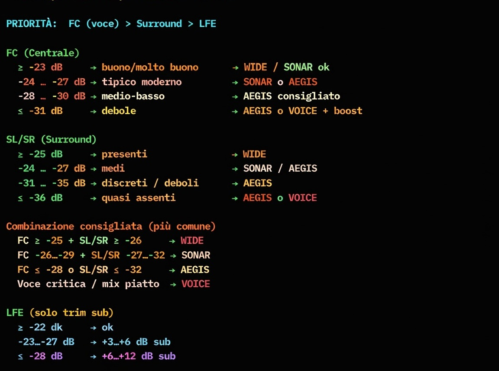

<p align="left">
  
</p>

# 🎧 Sonary Suite – Sonar / Wide / Aegis / Voice

DSP **offline** avanzato per tracce audio **5.1**, progettato per migliorare **intelligibilità del parlato**, **coerenza timbrica** e **spazialità surround** senza stravolgere il mix originale.

Pensato per AVR usati in modalità **Straight / Pure / Direct** (testato e ottimizzato su Yamaha RX-V4A), e compatibile con sistemi di correzione ambientale come **YPAO**.

> "Non tutti i supereroi indossano il mantello… a volte basta `filter_complex` per salvare il mondo del 5.1."  
> ⚡ Sandro (D@mocle77) Sabbioni ⚡
>   …perception follows physics…

---

## 🧠 Filosofia del progetto

Sonary Suite nasce da un principio semplice ma rigoroso:

> *correggere solo ciò che serve, dove serve, e nel modo meno invasivo possibile.*

Per questo motivo:
- l’elaborazione è **offline** (nessun DSP in tempo reale sull’AVR)
- **FL / FR restano neutri**
- **LFE non viene alterato**
- il canale **Centrale (FC)** riceve una EQ dedicata e costante (eq sartoriale)
- i **Surround** sono l’unico elemento variabile (Sonar / Wide / Aegis / oppure bypass in Voice)

Il risultato è un suono più intelleggibile, stabile e naturale, che **non combatte** il mix originale.

---

## ✅ Requisiti

### Software
- **FFmpeg 8** (consigliato con resampler **SOXR**)
- **Bash 4.x+**

### Sistemi operativi
- Linux
- macOS
- Windows (**WSL2**, **Git-Bash**, **MSYS2**)

---

## 🚀 Installazione

```bash
git clone https://github.com/Damocle77/Psicoacustics.git
cd Psicoacustics
chmod +x aegis_sonar_wide_voice.sh stereo251_psico.sh asmr_vr_psico.sh
```

---

## 📜 Script aggiuntivi inclusi

Oltre allo script principale `aegis_sonar_wide_voice.sh`, nel repo trovi anche due “utility” dedicate:

### 1) `stereo251_psico.sh` — Upmix **stereo → 5.1**
Pensato per sorgenti **2.0** (serie/film vecchi, release “stereo only”, ecc.) quando vuoi ottenere un 5.1 credibile (senza inventare un Atmos con la Forza).

Esempi:
```bash
# modalità: pan | surround | cinema
./stereo251_psico.sh surround 448k "episodio.mkv"
./stereo251_psico.sh cinema 640k "film.mkv"
```

### 2) `asmr_vr_psico.sh` — Preset **VR/ASMR “close presence”** (stereo → pseudo-binaurale)
Ottimizzato per cuffie / VR: crossfeed, EQ da sussurri ravvicinati e controllo loudness per un effetto “davanti al viso” (senza trasformare la voce in un demone radiofonico).

Esempi:
```bash
./asmr_vr_psico.sh "input.mkv"
./asmr_vr_psico.sh -o OUTDIR -k "input.mkv"   # -k mantiene anche la traccia originale
```

---

## 🧩 Utilizzo (script aggiornato)

```bash
./aegis_sonar_wide_voice.sh <ac3|eac3> <si|no> [file|""] [bitrate] [sonar|wide|aegis|voice]
```

### Parametri
- **codec**: `ac3` | `eac3`
- **keep_orig**: `si` | `no` (mantiene o no anche la traccia originale)
- **file**: `"film.mkv"` | `""` (batch: elabora tutti i file nella cartella)
- **bitrate**: es. `448k`, `640k`, `768k` (default: `ac3=640k`, `eac3=768k`)
- **mode**:
  - `sonar` = “altezza” (simulazione psicoacustica 5.1.2 verticale)
  - `wide`  = “ampiezza” (simulazione psicoacustica 7.1 orizzontale)
  - `aegis` = “intermedia” (Simulazione psicoacustica cupola sonora)
  - `voice` = **solo EQ Voce Sartoriale su FC** (surround pass-through)

### Esempi (singolo file)
```bash
./aegis_sonar_wide_voice.sh eac3 no  "film.mkv" 768k sonar
./aegis_sonar_wide_voice.sh ac3  si  "film.mkv" 640k wide
./aegis_sonar_wide_voice.sh eac3 no  "serie.mkv" 448k aegis
./aegis_sonar_wide_voice.sh ac3  si  "talkshow.mkv" 640k voice
```

### Esempi (batch cartella: file="")
```bash
./aegis_sonar_wide_voice.sh eac3 no "" 448k wide
./aegis_sonar_wide_voice.sh ac3  si "" 640k sonar
```

---

## 🎚️ EQ Voce Sartoriale (FC)

L’EQ Voce è **sempre attiva**, indipendentemente dalla modalità surround selezionata.
È progettata per esaltare il **parlato italiano**, con l’obiettivo di ottenere:
- massima intelligibilità anche a basso volume
- naturalezza timbrica
- minima fatica d’ascolto nel lungo periodo

### Curva attuale
- **−1.0 dB @ 230 Hz** → alleggerimento del corpo vocale
- **−1.0 dB @ 350 Hz** → riduzione “boxiness”
- **−0.5 dB @ 900 Hz** → micro de-nasalizzazione
- **+1.6 dB @ 1.0 kHz** → articolazione del parlato
- **+0.4 dB @ 1.8 kHz** → “chiodo” frontale
- **+2.3 dB @ 2.5 kHz** → attacco consonantico (T,K,S,F)
- **+0.35 dB @ 3.2 kHz** → presenza / intelligibilità
- **−1.0 dB @ 7.2 kHz** → controllo sibilanti

---

## 🔊 Modalità Surround – Architettura e bande di frequenza

Le modalità **Wide**, **Sonar** e **Aegis** usano approcci psicoacustici differenti, ma condividono una filosofia comune:  
*modellare lo spazio attraverso tempo e spettro, non attraverso artifici invasivi*.

### 1️⃣ Wide — Widening psicoacustico controllato (simulazione 7.1 virtuale)
Lavora sulla **dimensione orizzontale**: più ampiezza laterale e avvolgimento, senza arretrare il fronte né destabilizzare il centrale.

### 2️⃣ Sonar — Upfiring psicoacustico coerente (simulazione 5.1.2 virtuale)
Spinge su **profondità e verticalità percepita**, con micro-ritardi e stratificazioni sulle medio-alte per creare “altezza” credibile.

### 3️⃣ Aegis — Cupola psicoacustica (simulazione cupola virtuale)
Pensato quando vuoi “il meglio dei due mondi” ma con più disciplina: surround **meno invadente**, più **stabile** su contenuti rumorosi/affollati, e con una leggera **guardia dinamica**.

### 4️⃣ Voice — Solo parlato (FC-only)
Quando i surround sono inutili o dannosi (mix piatto, serie vecchie, dialoghi fragili): lascia i surround **così come sono** e applica solo l’EQ voce sul centrale.

---

## 🧪 Workflow consigliato: normalizzazione + analisi RMS + scelta profilo

Qui l’idea è *data-driven*, non “a naso”:

1) **Normalizzazione dinamica preventiva (si consiglia ffMediaMaster)**  
   Utile solo se la traccia ha una dinamica ingestibile (dialoghi troppo bassi, esplosioni che ti fanno saltare sul divano).  
   In **ffMediaMaster** applica una **normalizzazione dinamica leggera** (tipo *Dynamic Audio Normalizer / dynaudnorm* oppure un *loudnorm* non aggressivo), esportando una copia “preparata” per l’elaborazione.

   Fallback CLI (se vuoi applicare narmalizzazione dinamica a mano con FFmpeg, versione):
   ```bash
   ffmpeg -i "input.mkv" -map 0 -c copy -c:a pcm_s16le -af "dynaudnorm=f=150:g=5:m=10" "prep_audio.wav"
   ```

2) **Analisi RMS in (si consiglia Audacity)**  
   Apri la traccia 5.1 in Audacity (con FFmpeg installato), fai zoom su **2 finestre rappresentative** (scene action + scene dialogate), e misura RMS su:
   - **Surround (SL/SR)** → indice primario di *envelopment/immersione*
   - **Centrale (FC)** → priorità assoluta: **la voce deve stare sopra tutto**

3) **Applica lo schema decisionale (sotto)** per scegliere `wide / sonar / aegis / voice`.

4) **Fine-tuning (Front + LFE)** solo per aggiustamenti: *non cambia il profilo base*, ma ti evita quei casi “ok tutto… però i bassi sono morti”.

> Suggerimento pratico: se Audacity non mostra chiaramente la 5.1 come canali separati, usa “Split to mono” e analizza FC/SL/SR come tracce.

  Fallback CLI (se vuoi esportare manualmente il 5.1 in WAV multicanale con FFmpeg):  
  ```bash
   ffmpeg -hide_banner -y -i "input.mkv" -map 0:a:0 \
   -filter_complex "channelsplit=channel_layout=5.1[FL][FR][FC][LFE][SL][SR]" \
   -map "[FC]" -c:a pcm_s24le -ar 48000 "FC.wav" \
   -map "[SL]" -c:a pcm_s24le -ar 48000 "SL.wav" \
   -map "[SR]" -c:a pcm_s24le -ar 48000 "SR.wav"
  ```
  
---

## 🧭 Flusso decisionale RMS (schema semplice)
<p align="left">
  
</p>


### 1) Guarda RMS Surround (primo indicatore di immersione)
- **> −26 dB** → aggressivo → base: **WIDE**
- **−26 … −30 dB** → bilanciato → base: **SONAR**
- **−31 … −34 dB** → conservativo → base: **AEGIS**
- **< −34 dB** → debole/inutile → **AEGIS** o **VOICE** (o **NONE** se prevedi preset “no DSP surround”)

### 2) Guarda RMS FC / Centro (la voce comanda)
- **> −20 dB** → voce molto forte → ok, mantieni base
- **−21 … −24 dB** → voce buona → ok, mantieni base
- **−25 … −28 dB** → voce medio-bassa → forza **AEGIS** + considera **+2…+5 dB** sul centro
- **≤ −29 dB** → voce debole/scompare → forza **AEGIS** + **+3…+6 dB** sul centro (voice boost)

Regola d’oro: se FC è basso → *downgrade profilo* (da **WIDE → SONAR/AEGIS**, da **SONAR → AEGIS**, ecc.)

### 3) Conclusione profilo principale (surround + centro)
- Surround **> −26** + FC **≥ −22** → **WIDE**
- Surround **−26…−30** + FC **≥ −23** → **SONAR**
- Surround **−31…−34** o FC **≤ −24** → **AEGIS**
- Surround **< −34** o FC **≤ −28** → **AEGIS** (o **VOICE/NONE** se surround inutile)

### 4) Verifica fine-tuning: Front + LFE (solo aggiustamenti)
**Front L/R**
- ≈ FC (±3 dB) → ok
- Front > FC di **+4…+6 dB** → effetti front troppo forti → +1…+2 dB su FC se la voce fatica
- Front molto bassi (< −26 dB) → scena front debole → +2…+4 dB su Front L/R

**LFE**
- **> −18 dB** → bassi molto forti → perfetto (nessun boost)
- **−19 … −22 dB** → bassi buoni → ok
- **−23 … −26 dB** → bassi discreti → +3…+6 dB subwoofer
- **< −26 dB** → bassi deboli → +6…+10 dB subwoofer (o più se action)

**Risultato finale** = profilo del punto 3 + eventuali tweak del punto 4

---

## 🎥 Compatibilità AVR

- Ottimizzato per **Yamaha RX-V4A**
- Compatibile con qualsiasi AVR in modalità *Straight / Pure / Direct*
- Nessuna interferenza con YPAO o sistemi equivalenti
- Nessun DSP AVR richiesto

---

## 🚫 Cosa questo script NON fa

- non applica “dialog enhancer” artificiali
- non comprime aggressivamente la dinamica (a parte la guardia leggera in Aegis)
- non modifica i frontali
- non equalizza l’LFE
- non sostituisce la calibrazione ambientale

---

## 📄 Licenza

MIT License.

> *Per riportare ordine nella ForzaSonora serve solo uno script Bash… questa è la via.*
