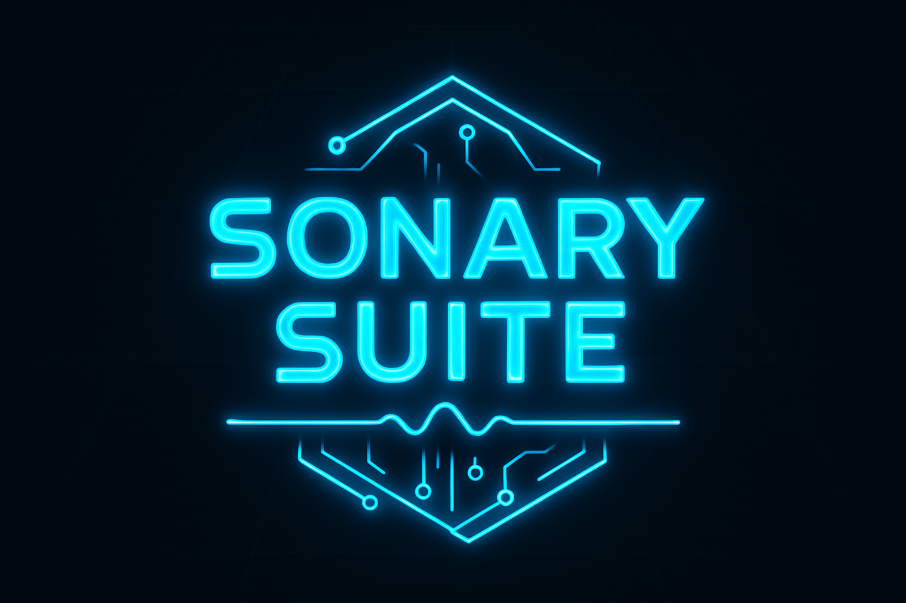

<p align="left">
  
</p>

# 🎧 Sonary Suite – Sonar / Wide / Aegis / Aura / Voice

DSP **offline** avanzato per tracce audio **5.1**, progettato per migliorare **intelligibilità del parlato**, **coerenza timbrica** e **spazialità surround** senza stravolgere il mix originale.

Pensato per AVR usati in modalità **Straight / Pure / Direct** (testato e ottimizzato su Yamaha RX-V4A), e compatibile con sistemi di correzione ambientale come **YPAO**.

> "Non tutti i supereroi indossano un mantello… a volte basta un `-filter_complex` per salvare il mondo del 5.1."  
> ⚡ Sandro (D@mocle77) Sabbioni ⚡  
> …perception follows physics…

---

## 🧠 Filosofia del progetto

Sonary Suite nasce da un principio semplice ma rigoroso:

> *correggere solo ciò che serve, dove serve, e nel modo meno invasivo possibile.*

Per questo motivo:
- l’elaborazione è **offline** (nessun DSP in tempo reale sull’AVR)
- **FL / FR restano neutri**
- **LFE non viene mai toccato**
- il canale **Centrale (FC)** riceve una EQ dedicata e costante
- i **Surround** sono l’unico elemento variabile (Sonar / Wide / Aegis / oppure bypass in Voice)

Il risultato è un suono più leggibile, stabile e naturale, che **non combatte** né YPAO né il mix originale.

> Nota “fisica non negoziabile”: **AC3 / E-AC3 si codificano sempre via CPU**. L’eventuale HW accel riguarda al massimo la *decodifica video*, non l’encoding audio.

---

## ✅ Requisiti

### Software
- **FFmpeg 7+** (consigliato con resampler **SOXR**)
- **Bash 4.x+**

### Sistemi operativi
- Linux
- macOS
- Windows (**WSL2**, **Git-Bash**, **MSYS2**)

---

## 🚀 Installazione

```bash
git clone https://github.com/Damocle77/Sonar_AC3D.git
cd Sonar_AC3D
chmod +x aegis_sonar_wide_aura_voice.sh
```

---

## 🧩 Utilizzo (script)

```bash
./aegis_sonar_wide_aura_voice.sh <ac3|eac3> <si|no> [file|""] [bitrate] [sonar|wide|aegis|aura|voice]
```

### Parametri
- **codec**: `ac3` | `eac3`
- **keep_orig**: `si` | `no` (mantiene o no anche la traccia originale)
- **file**: `"film.mkv"` | `""` (batch: elabora tutti i file nella cartella)
- **bitrate**: es. `448k`, `640k`, `768k` (default: `ac3=640k`, `eac3=768k`)
- **mode**:
- **mode**:
  - `sonar` = “altezza” (simulazione psicoacustica 5.1.2 verticale)
  - `wide`  = “ampiezza” (simulazione psicoacustica 7.1 orizzontale)
  - `aegis` = “intermedia” (guardia dinamica + cupola più controllata)
  - `aura`  = **Wide Light** (spazio laterale “soft” a bassa energia)
  - `voice` = **solo EQ Voce Sartoriale su FC** (surround pass-through)

### Esempi (singolo file)
```bash
./aegis_sonar_wide_aura_voice.sh eac3 no  "film.mkv" 768k sonar
./aegis_sonar_wide_aura_voice.sh ac3  si  "film.mkv" 640k wide
./aegis_sonar_wide_aura_voice.sh eac3 no  "serie.mkv" 448k aegis
./aegis_sonar_wide_aura_voice.sh ac3  si  "talkshow.mkv" 640k voice
```

### Esempi (batch cartella: file="")
```bash
./aegis_sonar_wide_aura_voice.sh eac3 no "" 448k wide
./aegis_sonar_wide_aura_voice.sh ac3  si "" 640k sonar
```

---

## 🎚️ EQ Voce Sartoriale (Canale Centrale – FC)

L’EQ Voce è **sempre attiva**, indipendentemente dalla modalità surround selezionata.
È progettata per esaltare il **parlato italiano**, con l’obiettivo di ottenere:
- massima intelligibilità anche a basso volume
- naturalezza timbrica
- minima fatica d’ascolto nel lungo periodo

### Curva attuale
- **−1.0 dB @ 230 Hz** → alleggerimento del corpo vocale
- **−1.0 dB @ 350 Hz** → riduzione “boxiness”
- **−0.5 dB @ 900 Hz** → micro de-nasalizzazione
- **+1.6 dB @ 1.0 kHz** → articolazione del parlato
- **+0.4 dB @ 1.8 kHz** → “chiodo” frontale
- **+2.3 dB @ 2.5 kHz** → attacco consonantico (T,K,S,F)
- **+0.35 dB @ 3.2 kHz** → presenza / intelligibilità
- **−1.0 dB @ 7.2 kHz** → controllo sibilanti

---

## 🔊 Modalità Surround – Architettura e bande di frequenza

Le modalità **Wide**, **Sonar** e **Aegis** usano approcci psicoacustici differenti, ma condividono una filosofia comune:  
*modellare lo spazio attraverso tempo e spettro, non attraverso artifici invasivi*.

### 1️⃣ Wide — Widening psicoacustico controllato (simulazione 7.1 virtuale)
Lavora sulla **dimensione orizzontale**: più ampiezza laterale e avvolgimento, senza arretrare il fronte né destabilizzare il centrale.

### 2️⃣ Sonar — Upfiring psicoacustico coerente (simulazione 5.1.2 virtuale)
Spinge su **profondità e verticalità percepita**, con micro-ritardi e stratificazioni sulle medio-alte per creare “altezza” credibile.

### 3️⃣ Aegis — Guardiano dinamico (cupola controllata)
Pensato quando vuoi “il meglio dei due mondi” ma con più disciplina: surround **meno invadente**, più **stabile** su contenuti rumorosi/affollati, e con una leggera **guardia dinamica**.

### 4️⃣ Aura — Wide Light (spazio laterale soft)
È la modalità “wide senza show”: lavora su una banda surround più **stretta** (zona di localizzazione laterale), con **decorrelazione lieve** e **energia contenuta**. Ideale quando i surround sono presenti ma non abbastanza solidi da giustificare Wide pieno.

### 5️⃣ Voice — Solo parlato (FC-only)
Quando i surround sono inutili o dannosi (mix piatto, serie vecchie, dialoghi fragili): lascia i surround **così come sono** e applica solo l’EQ voce sul centrale.


---

## 🧪 Workflow consigliato: normalizzazione + analisi RMS + scelta profilo

Qui l’idea è *data-driven*, non “a naso”:

1) **Normalizzazione dinamica preventiva (FFMediaMaster)**  
   Utile solo se la traccia ha una dinamica ingestibile (dialoghi troppo bassi, esplosioni che ti fanno saltare sul divano).  
   In **FFMediaMaster** applica una **normalizzazione dinamica leggera** (tipo *Dynamic Audio Normalizer / dynaudnorm* oppure un *loudnorm* non aggressivo), esportando una copia “preparata” per l’elaborazione Sonary.

   Fallback CLI (se vuoi farlo a mano con FFmpeg, versione *gentile*):
   ```bash
   ffmpeg -i "input.mkv" -map 0 -c copy -c:a pcm_s16le -af "dynaudnorm=f=150:g=5:m=10" "prep_audio.wav"
   ```
   *(Poi userai il file originale per il mux finale; questa è solo una “diagnosi/prep”.)*

2) **Analisi RMS in Audacity (scelta profilo)**  
   Apri la traccia 5.1 in Audacity (con FFmpeg installato), fai zoom su **2 finestre rappresentative** (scene action + scene dialogate), e misura RMS su:
   - **Surround (SL/SR)** → indice primario di *envelopment/immersione*
   - **Centrale (FC)** → priorità assoluta: **la voce deve stare sopra tutto**

3) **Applica lo schema decisionale (sotto)** per scegliere `wide / sonar / aegis / voice`.

4) **Fine-tuning (Front + LFE)** solo per aggiustamenti: *non cambia il profilo base*, ma ti evita quei casi “ok tutto… però i bassi sono morti”.

> Suggerimento pratico: se Audacity non ti mostra chiaramente la 5.1 come canali separati, usa “Split to mono” (o esporta temporaneamente il 5.1 in WAV multicanale con FFmpeg) e analizza FC/SL/SR come tracce.

---

## 🧭 Flusso decisionale RMS (schema semplice)

> Aggiungi questa immagine al repo (es. `docs/preset_schema.jpg`) e aggiorna il path se serve:
<p align="left">
  
</p>

### 1) Guarda RMS Surround (primo indicatore di immersione)
- **≥ −25 dB** → *presenti* → base: **WIDE**
- **−24 … −27 dB** → *medi* → base: **AURA**
- **−27 … −31 dB** → *discreti ma non affidabili* → base: **AEGIS**
- **≤ −36 dB** → *quasi assenti* → **AEGIS** o **VOICE**

### 2) Guarda RMS FC / Centro (la voce comanda)
- **> −20 dB** → voce molto forte → ok, mantieni base
- **−21 … −24 dB** → voce buona → ok, mantieni base
- **−25 … −28 dB** → voce medio-bassa → forza **AEGIS** + considera **+2…+5 dB** sul centro
- **≤ −29 dB** → voce debole/scompare → forza **AEGIS** + **+3…+6 dB** sul centro (voice boost)

Regola d’oro: se FC è basso → *downgrade profilo* (da **WIDE → SONAR/AEGIS**, da **SONAR → AEGIS**, ecc.)

### 3) Conclusione profilo principale (surround + centro)
- **FC ≥ ~−25** e **SL/SR ≥ −26** → **WIDE**
- **FC ≥ ~−25** e **SL/SR ~−27…−30** → **AURA**
- **FC ~ −26…−27** e **SL/SR ~−27…−32** → **SONAR**
- **FC ≤ −28** o **SL/SR ≤ −32** → **AEGIS**
- **Voce critica / mix piatto** → **VOICE**

### 4) Verifica fine-tuning: Front + LFE (solo aggiustamenti)
**Front L/R**
- ≈ FC (±3 dB) → ok
- Front > FC di **+4…+6 dB** → effetti front troppo forti → +1…+2 dB su FC se la voce fatica
- Front molto bassi (< −26 dB) → scena front debole → +2…+4 dB su Front L/R

**LFE**
- **> −18 dB** → bassi molto forti → perfetto (nessun boost)
- **−19 … −22 dB** → bassi buoni → ok
- **−23 … −26 dB** → bassi discreti → +3…+6 dB subwoofer
- **< −26 dB** → bassi deboli → +6…+10 dB subwoofer (o più se action)

**Risultato finale** = profilo del punto 3 + eventuali tweak del punto 4

---

## 🎥 Compatibilità AVR

- Ottimizzato per **Yamaha RX-V4A**
- Compatibile con qualsiasi AVR in modalità *Straight / Pure / Direct*
- Nessuna interferenza con YPAO o sistemi equivalenti
- Nessun DSP AVR richiesto

## 🛋️ Layout consigliato della stanza

Per far rendere **Sonar / Wide / Aegis / Aura** (e per evitare l’effetto “surround a caso lanciato dal balcone”), il punto chiave è la **simmetria** rispetto alla posizione d’ascolto e un fronte **L/C/R** ben centrato sul TV.

<p align="left">
  
</p>

Note pratiche:
- **Front L/R**: circa a **±30°** rispetto alla linea centrale (≈ **60°** totali), tweeter a livello orecchie.
- **Center**: sotto/sopra il TV, centrato e inclinato verso le orecchie (nell’immagine è a ~**140 cm**).
- **Surround L/R**: laterali o leggermente arretrati rispetto al punto d’ascolto; meglio non troppo alti (altrimenti “piove audio” anche quando non dovrebbe).
- **Subwoofer**: la posizione è la più “stregonesca” (dipende dalla stanza). Se puoi, fai il classico *sub crawl* e scegli il punto con bassi più uniformi.

> Se metti l’immagine in una cartella diversa da `docs/`, aggiorna semplicemente il path nello `src`.


---

## 🚫 Cosa questo script NON fa

- non applica “dialog enhancer” artificiali
- non comprime aggressivamente la dinamica (a parte la guardia leggera in Aegis)
- non modifica i frontali
- non equalizza l’LFE
- non sostituisce la calibrazione ambientale

---

## 📄 Licenza

MIT License.

> *Per riportare ordine nella Forza Sonora serve solo uno script Bash… questa è la via.*
