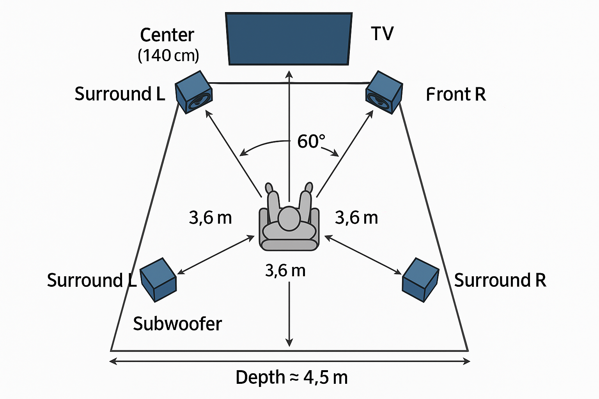

# 🎧 Sonar AC3D Suite — Virtual Upfiring + EQ Voce Sartoriale

> “Non tutti i supereroi indossano un mantello... a volte usano `filter_complex` per salvare il mondo del 5.1.”  
> *by Sandro "D@mocle77" Sabbioni*

---

## 🚀 Descrizione

**Sonar AC3D** è una pipeline Bash basata su **FFmpeg**, progettata per rifinire e normalizzare l’audio 5.1
con un approccio **cinematografico e naturale**, ottimizzato per soundbar e home theater compatti.

L’obiettivo è ottenere un ascolto equilibrato e coinvolgente grazie a:
- **EQ sartoriale della voce** per massima intelligibilità (FC +1.5 dB / FL-FR +1.1 dB @ 2.4 kHz)  
- **Virtual upfiring** in stile **AtmosX/NeuralX** per creare una *cupola sonora virtuale* anche senza speaker Height  
- **LFE in passthrough totale**, senza tagli o compressione: sub naturale e coerente  
- **Limiter trasparente (0.97)** e **resampling SoX** ad alta precisione  
- Compatibilità completa: video e sottotitoli vengono sempre copiati 1:1  

---

## 🧩 Script incluso

| Script | Descrizione | Note principali |
|--------|--------------|----------------|
| **`convert_2ac3_sonar.sh`** | Versione unificata (v0.88) con LFE passthrough, voce +1 dB e surround realistico | Compatibile con pipeline ffMediaMaster, include supporto batch |

---

## 🧠 Requisiti

- **FFmpeg** ≥ 5.0 e **FFprobe** nel `PATH`
- Input con **prima traccia audio 5.1** (`side` o `back`)
- Ambiente consigliato: **Git Bash su Windows**, o **Bash Linux**

### Installazione rapida
```bash
git clone https://github.com/Damocle77/Sonar_AC3D.git
cd Sonar_AC3D
chmod +x *.sh
```

---

## ⚙️ Uso rapido

```bash
./convert_2ac3_sonar.sh <sonar|clean> <si|no> [file.mkv/.mp4] [bitrate]
```

| Parametro | Significato |
|------------|-------------|
| `sonar` | Surround con virtual upfiring AtmosX-style (+3.6 dB) |
| `clean` | Surround neutro, senza upfiring (+3.3 dB) |
| `si|no` | Mantiene o meno la traccia originale |
| `[file]` | File singolo o `""` per elaborazione batch |
| `[bitrate]` | 256k – 640k (default = 640k) |

**Esempi**
```bash
# 1️⃣ Singolo film con effetto upfiring
./convert_2ac3_sonar.sh sonar no "Dune.mkv" 640k

# 2️⃣ Tutti i file .mkv nella cartella
./convert_2ac3_sonar.sh sonar no ""

# 3️⃣ Mix più neutro, conserva la traccia originale
./convert_2ac3_sonar.sh clean si "Tenet.mkv" 448k
```

---

## 🧠 Pre-processing consigliato (ffMediaMaster o equivalenti)

> Questa fase serve a linearizzare il mix sorgente (DTS, EAC3, Atmos, Core) prima della conversione.

| Impostazione | Valore consigliato |
|---------------|--------------------|
| **Perform Audio Peak Normalization** | −2 dBFS (oppure −1 dB se già AC3/EAC3 640k) |
| **Dynamic Normalization** | ON |
| **Target Peak Value** | 92 |
| **Max Gain** | 10 |
| **RMS / Compress** | 0 / 0 |
| **Channel Coupling** | ON |
| **Gaussian Filter Window** | 31 |
| **Output** | AC3 5.1 @ 640 kbps / 48 kHz |
| **Loudness extra** | Nessuno |

📄 Dopo l’esportazione, esegui:
```bash
./convert_2ac3_sonar.sh sonar no "Film_AC3_640k.mkv" 640k
```

Il risultato sarà **equilibrato, chiaro e naturale**, con:
- voci più leggibili anche a basso volume  
- subwoofer arioso e coerente  
- surround ampio e immersivo  

---

## 🔊 Parametri tecnici chiave (v0.88)

| Sezione | Parametri | Descrizione |
|----------|------------|-------------|
| EQ Voce | FC +1.5 dB / FL-FR +1.1 dB @ 2.4 kHz (Q 1.0) | Chiarezza e presenza |
| Upfiring Sonar | Delay 24–28 ms · Bandpass 6.5 kHz (+3 dB) / 11 kHz (−2 dB) | Cupola sonora virtuale |
| Surround boost | +3.6 dB (Sonar) / +3.3 dB (Clean) | Ampiezza controllata |
| LFE | Passthrough puro (nessun filtro) | Sub naturale |
| Output | AC-3 5.1 · 48 kHz · Limiter 0.97 · soxr precision 28 | Alta compatibilità |

---

## 🏠 Ambiente di riferimento

| Parametro | Valore |
|------------|--------|
| Stanza | 4 × 5 m |
| Altezza soffitto | 4.1 m |
| Distanza ascoltatore-TV | 3.6 m |
| Altezza centrale | 140 cm |
| Altezza frontali | 60–70 cm |
| Altezza surround | 120 cm (~1 m dietro l’ascoltatore) |
| Risultato | Cupola sonora coerente e immersiva |

---

## 🗺️ Schema stanza di ascolto (Sonar Room 4×5×4.1 m)

L’immagine seguente rappresenta la disposizione consigliata con preset **Sonar**.

<p align="center">
  
</p>

**Legenda**
- Altoparlante centrale: sopra la TV (≈140 cm)
- Frontali L/R: 60–70 cm da terra
- Surround L/R: 120 cm di altezza, ~1 m dietro l’ascoltatore
- Subwoofer: centrato o leggermente decentrato a sinistra
- Angoli: 60° frontali / 110° posteriori

🟩 *Ottimizzato per stanza 4 m (prof.) × 5 m (largh.) × 4.1 m (h)*

---

## 🧪 Utility diagnostica

```bash
./convert_2AC3_audiocheck.sh <file.mkv>
```
Mostra codec, canali, bitrate, lingua e titolo delle tracce audio.

---

## 🪶 Licenza

MIT — usa, modifica e condividi liberamente.  
Se la tua soundbar vibra come un X-Wing al decollo, lascia una ⭐ su GitHub.  
**Questa è la via.**
