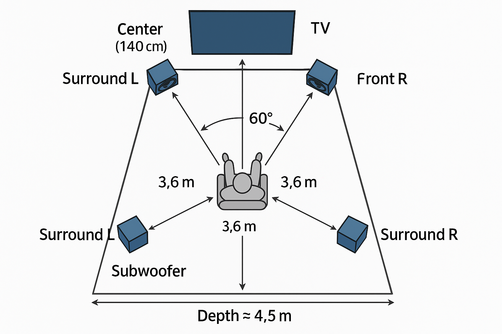

<p align="left">
  
</p>

# 🎧 Psychoacoustic Suite - Settembre 2026

Suite di script **Bash AWK + FFmpeg** per analizzare, normalizzare, correggere e trasformare tracce audio stereo, 5.1 ed EAC3 Atmos/JOC in modo offline, ripetibile e controllato.

> Non tutti i supereroi indossano un mantello. Alcuni lanciano `ffmpeg` e salvano i dialoghi dal multiverso del mix sbagliato.

## Indice degli argomenti

- [Schema di riferimento](#schema-di-riferimento)
- [Requisiti](#requisiti)
- [Installazione](#installazione)
- [Script inclusi](#script-inclusi)
- [Quick Start](#quick-start)
- [1. Analyzer: analisi e classificazione 5.1](#1-audio_analyzer_volamp_psychosh)
- [2. Aegis / Sonar / Wide / Aura / Voice: processing 5.1](#2-aegis_sonar_wide_aura_voice_volamp_psychosh)
- [3. Upmix stereo → 5.1](#3-stereo251_upmix_psychosh)
- [4. ASMR / VR: processing per cuffie](#4-asmr_vr_intimate_psychosh)
- [5. Atmos: preparazione EAC3 5.1](#5-atmos_to_51_dynaudnorm_psichosh)
- [Workflow consigliati](#workflow-consigliati)
- [Benchmark orientativo](#benchmark-orientativo)
- [Troubleshooting](#troubleshooting)
- [Cosa la suite non fa](#cosa-la-suite-non-fa)
- [Licenza](#licenza)
- [Autore](#autore)

La filosofia è semplice: **misurare prima, processare dopo**. Il Classifier dell'analyzer misura scena full-band, prominenza della voce, mascheramento e width dei surround; sceglie quindi il preset per-file più adatto e può generare un batch riproducibile. Gli altri script coprono upmix stereo, preparazione Atmos/EAC3 e processing binaurale per cuffie.

La taratura 5.1 è pensata per un impianto domestico ibrido con frontali a torre 3 vie, centrale e surround compatti, tutti configurati **Small** con crossover AVR unico intorno a **110 Hz**, uno o due subwoofer attivi gestiti dall'AVR, ascolto medio/basso e priorità all'intelligibilità della voce italiana.

Setup di riferimento: **Yamaha RX-V4A**, frontali **Harman Kardon 3 vie**, centrale/surround **JBL SCS200**, 2x subwoofer **Kenwood ST40**, bass management AVR a **110 Hz**.

I frontali a torre vengono comunque utilizzati come diffusori **Small**: il loro vantaggio è principalmente nella maggiore capacità dinamica e nella migliore riproduzione della gamma medio-alta, mentre il contenuto sotto il crossover resta affidato al bass management dell'AVR.

Il `FRONT_EQ` del processore mantiene il carattere del voicing originale ma riduce leggermente l'enfasi sulle alte frequenze rispetto alla taratura nata per satelliti compatti, senza introdurre widening o modifiche alla scena frontale.

## Schema di riferimento

<p align="left">
  
</p>

Obiettivi principali:

- dialoghi intelligibili senza effetto megafono;
- surround presenti ma non invadenti;
- basso controllato, con gestione principale demandata ad AVR e subwoofer;
- processing selettivo: SONAR non viene applicato indiscriminatamente;
- make-up gain finale coerente fra analyzer e processore;
- batch ripetibili su film, episodi e cartelle intere;
- conservazione separata del percorso Atmos originale quando richiesta.

---

## Requisiti

### Software

- **FFmpeg 8.x** richiesto e supportato;
- **ffprobe**;
- **Bash 4.x+**;
- **awk** per analisi e controlli audio;
- **mktemp** per i temporanei di analyzer, upmix, pre-processore Atmos e ASMR;
- **GNU coreutils** per l’analyzer (`sha256sum`, `stat -c`, `realpath`, `mv -T`), oltre alle normali utility shell;
- build FFmpeg con **libsoxr** per `stereo251_upmix...`;
- build FFmpeg con **libbs2b** per `asmr_vr_intimate...`.

La suite è sviluppata e verificata con **FFmpeg/ffprobe 8.1.2**. Non usare release con major superiore a 8 (`9.x` o successive) finché la suite non viene nuovamente validata: output testuale di `astats`/`ebur128`, opzioni dei filtri e semantica dei channel layout possono cambiare. Anche FFmpeg 7.x e precedenti sono fuori dal perimetro supportato. È consigliato usare `ffmpeg` e `ffprobe` provenienti dalla stessa build.

L’upmix richiede `resampler=soxr` e controlla SOXR all’avvio, senza fallback automatico. Lo script ASMR verifica invece `bs2b` all'avvio e termina con un errore esplicito se il filtro non è disponibile.

Verifiche utili:

```bash
ffmpeg -version
ffprobe -version
ffmpeg -hide_banner -filters 2>/dev/null | grep -w bs2b
ffmpeg -hide_banner -h filter=aresample 2>&1 | grep -i soxr
```

### Sistemi operativi

- Linux;
- macOS con Bash 4+ e GNU coreutils nel `PATH` (la dotazione di sistema non basta per l’analyzer);
- Windows tramite MSYS2, Git Bash o WSL2.

AC3/EAC3 vengono codificati via CPU. L'accelerazione hardware, quando disponibile, riguarda normalmente il video, che in questa suite viene copiato senza ricodifica.

---

## Installazione

```bash
git clone https://github.com/Damocle77/Sonary_Suite.git
cd Sonary_Suite
chmod +x *.sh
```

Controllo sintattico rapido:

```bash
for f in *.sh; do
  bash -n "$f" || exit 1
done
```

---

## Script inclusi

| Script | Scopo |
|---|---|
| `audio_analyzer_volamp_psycho.sh` | Classifier per 5.1: Delta surround/centro, banda voce, mascheramento, width, target `-21 LUFS`, volamp automatico **3.0–4.5 dB** e batch opzionale |
| `aegis_sonar_wide_aura_voice_volamp_psycho.sh` | Processore 5.1 con preset `aegis`, `sonar`, `wide`, `aura`, `voice`, EQ voce, surround psicoacustici, controllo LFE e compensazione FC/LFE attivata dal profilo EAC3 Atmos o dal marker originale |
| `stereo251_upmix_psycho.sh` | Upmix stereo → 5.1 plausibile: matrice L-R, centro assist, LFE minimo, output atomico/verificato e preset `quad` dedicato alla musica |
| `asmr_vr_intimate_psycho.sh` | Processing stereo per cuffie/ASMR/VR con BS2B, ITD opzionale, loudnorm post-DSP, LFO e output atomico/verificato |
| `atmos_to_51_dynaudnorm_psicho.sh` | Prepara un MKV con EAC3 5.1 normalizzata come primaria e traccia Atmos/EAC3 originale copiata come secondaria |

> Nota naming: il file Atmos mantiene il nome storico `psicho`. Il README usa il nome reale del file.

---

## Quick Start: comandi manuali

Analizzare un file senza generare il batch:

```bash
./audio_analyzer_volamp_psycho.sh eac3 no 768k no "film.mkv"
```

Elaborare un file scegliendo preset e volume (qui SONAR, 3 dB):

```bash
./aegis_sonar_wide_aura_voice_volamp_psycho.sh eac3 si 768k sonar 3.0 "film.mkv"
```

Elaborare tutti i file compatibili nella cartella corrente:

```bash
./aegis_sonar_wide_aura_voice_volamp_psycho.sh eac3 si 768k sonar 3.0 ""
```

Il contributo verticale aumentato è già predefinito per SONAR e AEGIS. La compensazione Atmos si attiva sulle sorgenti riconosciute. I comandi diretti qui mostrati non trasferiscono automaticamente i gain LFE/Bass trim calcolati dall'analizzatore: queste due correzioni restano a zero. Il flusso con batch che le applica è descritto nella sezione dell'analizzatore.

---

# 1. `audio_analyzer_volamp_psycho.sh`

Analyzer per tracce **5.1**. Non modifica i file audio.

Il classificatore separa la scena full-band dalla banda utile alla voce:

```text
DeltaSur   = RMS(SL/SR) - RMS(FL/FR/FC)
DeltaFC    = RMS(FC) - RMS(FL/FR)
VoiceDelta = RMS 250-5000 Hz(FC) - RMS 250-5000 Hz(FL/FR)
VoiceMask  = RMS 250-5000 Hz(SL/SR) - RMS 250-5000 Hz(FC)
```

`VoiceDelta` misura la prominenza del centrale nella banda del parlato;
`VoiceMask` aumenta quando effetti e ambienza posteriori possono mascherarlo.
Le metriche full-band restano dedicate alla scelta del trattamento spaziale.

**Limite VoiceBand:** queste metriche misurano energia fra 250 e 5000 Hz, non
riconoscono il parlato. Musica, motori o altri effetti nel centrale possono far
apparire favorevoli `VoiceDelta` e `VoiceMask` anche quando coprono i dialoghi.
`CENTER_FULL_SAFETY_GATE` controlla invece il bilanciamento full-band: nessuna
di queste soglie separa voce ed effetti nello stesso canale. Le medie sull'intera
traccia possono inoltre nascondere singole scene problematiche. Il preset
suggerito resta un'indicazione di bilanciamento, non una misura certificata
dell'intelligibilità.

Il preset **VOICE** mantiene la priorità al centrale con EQ dedicata e surround
contenuti, senza decorrelazione aggiunta. Tratta tutto il centrale, inclusi gli
effetti: non isola i dialoghi. La taratura è fissa, non adattata automaticamente
alla voce di ogni film.

## Caratteristiche

- selezione del 5.1 score-based: lingua italiana e flag default, senza confronto con la durata del container;
- misura in un'unica decodifica full-duration `I(full)`, `LRA`, sample peak,
  full-band, banda voce, `Width MS` e finestre LFE/bassi;
- indicatore di avanzamento durante la scansione completa;
- cache persistente delle metriche, invalidata automaticamente quando cambia il file, lo stream o lo schema analitico;
- discriminante Atmos tramite profilo E-AC-3 ufficiale esposto da FFprobe, con marker stabile del pre-processore come fallback;
- target loudness interno: **`-21.0 LUFS`**;
- fake-5.1 gate: se i surround sono virtualmente muti, forza `voice`;
- priorità a `voice` quando il centro è debole o mascherato nella banda 250-5000 Hz;
- `sonar` per surround molto arretrati, `aura` per arretramento moderato;
- `wide` quando SL/SR risultano stretti o collassati, `aegis` per mix equilibrati;
- verdetto stagionale modale con almeno **2/3 di consenso**; altrimenti `MIXED`;
- `MIXED` anche quando lo spread di `DeltaSur` supera `4 dB`;
- volamp automatico con base **3.0 dB** e massimo **4.5 dB**;
- cap del volamp a **3.5 dB** quando `LRA >= 18 LU`;
- `run_processing.sh` opzionale tramite parametro `run=si|no`;
- colori distinti in console:
  - SONAR rosso;
  - AEGIS arancione;
  - WIDE verde;
  - AURA viola/magenta;
  - VOICE giallo.

## Sintassi

```bash
./audio_analyzer_volamp_psycho.sh <codec> <keep> <bitrate> <run> <file|directory|"">
./audio_analyzer_volamp_psycho.sh --files <codec> <keep> <bitrate> [run] <file1> [file2 ...]
```

Compatibilità: resta accettato il vecchio ordine `<file|directory|""> [codec] [keep] [bitrate] [run]`.

## Parametri

| Parametro | Valori | Default | Note |
|---|---|---:|---|
| `codec` | `eac3`, `ac3` | `eac3` | codec scritto nel batch |
| `keep` | `si`, `no` | `no` | indica al processore se conservare la traccia sorgente selezionata |
| `bitrate` | `256k–640k` AC3; `256k–768k` EAC3, step da `64k` | `640k` AC3, `768k` EAC3 | accetta anche il numero senza suffisso; valori fuori range o fuori step vengono rifiutati |
| `run` | `si`, `no` | `si` | crea/aggiorna oppure non tocca `run_processing.sh` |
| `file|directory|""` | file, directory o stringa vuota | obbligatorio | `""` usa la cartella corrente |

## Bilanciamento LFE automatico

L'analyzer calcola e applica nel batch un **gain statico per file entro ±2 dB**. Non usa AGC, non cambia la scelta di preset/VOLAMP e non modifica i limiter. Il preparatore Atmos non riceve processing LFE dedicato; il mux diretto e l'opzione del passa-alto restano invariati.

Le misure LFE condividono la decodifica integrale già usata per loudness, RMS e banda voce. Un ramo solo analitico filtra i sei canali a **20–120 Hz** e li divide in finestre coincidenti da **0,5 secondi**, senza padding dell'ultima finestra. Questo filtro di misura non modifica il file né introduce un passa-alto nel processing finale.

- **Active RMS:** media energetica LFE, pesata per campioni, delle finestre sopra la maggiore fra `−60 dBFS` e il massimo RMS di finestra meno `30 dB`.
- **P95:** percentile 95 delle stesse finestre attive, pesato per campioni, con istogramma a risoluzione 0,1 dB.
- **Peak:** massimo sample peak LFE full-band, compresa l'energia fuori dalla banda analitica; non è True Peak.
- **Bass mains:** somma delle energie FL/FR/FC/SL/SR sulle medesime finestre attive LFE, mediata nel tempo. Non è una somma dei segnali e non simula fase, crossover o acustica dell'AVR.
- **Delta:** Active RMS meno Bass mains. Non si assume che zero rappresenti equilibrio acustico.

Le soglie nella sezione `LFE_*` valgono per **tutte le sorgenti 5.1 supportate**, Atmos e non Atmos. La classe descrive il delta originale:

| Delta LFE − bass mains | Classe |
|---|---|
| `< −18 dB` | VERY_WEAK |
| `−18 .. < −14 dB` | WEAK |
| `−14 .. −6 dB` | BALANCED |
| `> −6 .. −2 dB` | HOT |
| `> −2 dB` | VERY_HOT |

### Attenuazione: eccesso e persistenza

Per applicare un taglio servono almeno **30 secondi di LFE attivo** e un riferimento mains medio superiore a `−60 dBFS`. Per i tagli non è più richiesto che l'attività copra il 5% dell'intero file.

La **persistenza** è la percentuale del tempo LFE attivo in cui il delta della singola finestra supera una soglia, pesata per campioni. Le finestre senza bassi mains sopra `−60 dBFS` non confermano l'eccesso, ma restano nel denominatore. Una finestra finale parziale pesa soltanto per i campioni effettivi.

| Condizione dopo l'eventuale compensazione Atmos | Gain LFE candidato |
|---|---:|
| Delta medio `> −2 dB` e almeno il **50%** del tempo attivo con delta `> −2 dB` | **−2 dB** |
| Altrimenti, delta medio `> −6 dB` e almeno il **25%** del tempo attivo con delta `> −6 dB` | **−1 dB** |
| Eccesso occasionale o già compensato | **0 dB** |

Le soglie di delta sono strette (`>`); durata minima e percentuali includono il valore di soglia (`>=`). Se non è confermato il taglio di −2 dB, viene comunque valutato quello di −1 dB. Il gain resta fisso per tutto il file: non segue le singole scene.

```bash
LFE_CUT_MIN_ACTIVE_SECONDS=30.0
LFE_HOT_MIN_PERSISTENCE=0.25
LFE_VERY_HOT_MIN_PERSISTENCE=0.50
LFE_ATMOS_COMPENSATION_DB=-1.0
```

Queste sono costanti nello script, non opzioni CLI. Per le sorgenti Atmos verificate, delta e persistenza usati per il taglio includono il **−1 dB LFE già previsto dal processore**. Per le altre sorgenti l'offset è zero. La cache conserva entrambe le coppie di persistenza, prima e dopo la compensazione. VOLAMP è comune a LFE e principali e si cancella nel rapporto.

La classe può quindi restare `VERY_HOT` mentre il gain è −1 o 0 dB. Il report mostra delta originale, delta dopo compensazione, offset Atmos, persistenza come frazione (`0.43` = 43%), attività, classe, gain e motivo. Il successivo coordinamento con Bass trim può ridurre ulteriormente il taglio LFE.

### Aumenti e dati insufficienti

Gli aumenti mantengono i controlli precedenti: almeno **10 secondi** di LFE attivo e il **5%** dei campioni del file, con mains sopra `−60 dBFS`. `VERY_WEAK` propone +2 dB e `WEAK` +1 dB. Prima di consentire il boost si considera la somma nominale di VOLAMP, compensazione Atmos e nuovo gain: P95 non oltre `−18 dBFS` e sample peak full-band non oltre `−2 dBFS`. Il boost può essere ridotto in passi di 0,5 dB o azzerato.

LFE assente, layout non confermabile, dati insufficienti o override di sicurezza del 5.1 producono `INSUFFICIENT_DATA` e **0 dB**. Il probe può estendere l'analisi iniziale a 20 MB / 20 secondi per confermare il layout.

Le soglie sono sperimentali, da tarare all'ascolto. Per i tagli non è stata introdotta una nuova soglia assoluta RMS/P95. Il gain Dolby di riproduzione non viene aggiunto al file. La correzione riguarda il **canale LFE**: il subwoofer riceve anche i bassi dei principali tramite bass management. Un LFE a gain zero può comunque essere attenuato dal Bass trim. I margini sui picchi non costituiscono una verifica True Peak post-codec.

### Batch e cache

Rigenerare `run_processing.sh` per usare le nuove decisioni: i batch esistenti conservano i gain espliciti già calcolati. Il batch passa `--lfe-gain` e `--bass-trim` al processore; le singole righe restano modificabili entro i range consentiti.

La cache usa lo schema **`classifier-rms-voiceband-ebur-lfe-bass-v5-persistence`**, con 38 campi. Conserva le misure LFE e Bass, quattro frazioni di persistenza LFE, attività e ultime decisioni. Le strutture precedenti vengono invalidate automaticamente. Finestra, gate di misura, soglie HOT/VERY_HOT LFE, offset Atmos e soglia HOT Bass entrano nella chiave perché cambiano le misure. Durata minima e percentuali richieste per decidere il taglio vengono ricalcolate anche su cache HIT.

## Bass trim automatico: bassi complessivi

LFE balance corregge il rapporto fra LFE e principali. **Bass trim** affronta invece un mix ricco di bassi anche nei principali: applica un **low-shelf a 100 Hz, Q 0,707, da 0 a −3 dB su tutti e sei i canali**, prima dei limiter. Non modifica preset o VOLAMP, non introduce un passa-alto e non aumenta mai i bassi.

L'analyzer riusa le finestre 20–120 Hz da 0,5 s e aggiunge, nella stessa decodifica, un riferimento sincronizzato 250–5000 Hz. Il confronto usa:

- bassi: somma delle energie dei cinque principali più energia LFE pesata di un fattore 10 (+10 dB **solo nel calcolo**, mai aggiunti al file);
- riferimento: somma delle energie medio-alte dei cinque principali, sulle medesime finestre;
- finestre valide: riferimento sopra la maggiore fra −60 dBFS e il massimo RMS di riferimento meno 30 dB;
- Bass Delta: rapporto in dB fra le medie energetiche dei bassi e del riferimento, pesate per campioni;
- persistenza: frazione dei campioni validi nelle finestre con rapporto bassi/riferimento superiore a +6 dB;
- P95 Delta: percentile diagnostico del rapporto per finestra, con risoluzione 0,1 dB.

È una **stima energetica**, non una ricostruzione del segnale fisico del sub: non comprende fase, crossover, calibrazione, modi della stanza o la risposta dei diffusori. Il livello assoluto da solo non decide il trim. Il filtro di analisi non viene applicato al file audio.

Servono almeno 10 secondi validi, il 5% del file e layout affidabile senza override di sicurezza del 5.1. In caso contrario: `INSUFFICIENT_DATA`, trim zero. Una persistenza inferiore al 25% lascia trim zero anche in presenza di picchi forti. Con evidenza sufficiente:

| Bass Delta | Classe | Trim |
|---|---|---:|
| ≤ +6 dB | BALANCED | 0 dB |
| > +6 .. +9 dB | HOT | −1 dB |
| > +9 .. +12 dB | VERY_HOT | −2 dB |
| > +12 dB | EXTREME | −3 dB |

Le costanti `BASS_*` dell'analyzer sono soglie iniziali euristiche, da tarare con confronti d'ascolto; non sono uno standard di mastering. L'attenuazione è fissa per tutto il file: nessun AGC. Il report mostra riferimento, delta, P95, persistenza, durata valida, classe, trim e motivo.

**Coordinamento automatico:** quando Bass trim è negativo, un eventuale boost LFE viene azzerato. Se gain LFE + Bass trim scenderebbe sotto −3 dB, viene ridotto il taglio LFE. Il budget vale per le nuove correzioni automatiche nel basso profondo e non include VOLAMP o compensazione Atmos. Vicino a 100 Hz il low-shelf è in transizione, quindi la somma non rappresenta un gain piatto su tutta la banda.

Il processore accetta anche la scelta manuale:

```bash
./aegis_sonar_wide_aura_voice_volamp_psycho.sh eac3 no 768k sonar 3.0 --lfe-gain 0 --bass-trim -2 "film.mkv"
./aegis_sonar_wide_aura_voice_volamp_psycho.sh --files eac3 no 768k sonar 3.0 --bass-trim -1 -- "ep 1.mkv" "ep 2.mkv"
```

`--bass-trim` accetta decimali con punto fra −3 e 0; default 0, nessun filtro aggiunto. Il parser rifiuta valori positivi, non numerici, fuori range, mancanti o opzioni ripetute. Il processore applica i valori manuali indicati: il coordinamento del budget viene effettuato dall'analyzer, non sovrascrive una scelta manuale esplicita.

Ordine finale: **processing preset → Bass shelf su ciascun canale → gain VOLAMP/LFE/Atmos previsti → limiter di canale → join → limiter master**. Le impostazioni dei limiter non cambiano. Nei log la somma dei gain LFE è indicata separatamente dal low-shelf, che dipende dalla frequenza.

Rigenerare il batch con `run=si` per ottenere entrambe le correzioni automatiche. I comandi preesistenti senza `--bass-trim` mantengono il risultato precedente. Il preparatore Atmos e il suo mux diretto restano invariati. Il nuovo schema cache invalida automaticamente i record precedenti.

## Cache e avanzamento

La prima analisi resta full-duration. Le metriche validate vengono salvate nella
cartella `.clearvoice_analyzer_cache`; una successiva analisi dello stesso file
le riutilizza senza decodificare nuovamente l'episodio. La chiave comprende
percorso canonico, dimensione, data di modifica, indice dello stream e versione
dell'algoritmo.

```bash
ANALYZER_CACHE=0 ./audio_analyzer_volamp_psycho.sh eac3 no 768k si ""
ANALYZER_PROGRESS_INTERVAL=5 ./audio_analyzer_volamp_psycho.sh eac3 no 768k si ""
ANALYZER_CACHE_DIR=/percorso/cache ./audio_analyzer_volamp_psycho.sh eac3 no 768k si ""
```

`ANALYZER_CACHE=0` disattiva la cache; l'intervallo di avanzamento predefinito è
10 secondi. Eliminare `.clearvoice_analyzer_cache` forza un ricalcolo completo.

Dopo un cambio di taratura, rigenerare `run_processing.sh`: i batch già creati conservano i volamp, i gain LFE e i Bass trim espliciti precedenti. La cache contiene metriche audio e può essere riutilizzata quando cambiano solo le soglie decisionali.

Con `run=no`, un eventuale `run_processing.sh` già esistente **non viene sovrascritto né cancellato**.

Nella modalità `--files`, il token dopo il bitrate viene interpretato come `run` solo se è esattamente `si` o `no`; altrimenti è trattato come primo filename, mantenendo la compatibilità con la sintassi precedente.

## Esempi

```bash
# Singolo file, EAC3 768k, batch abilitato
./audio_analyzer_volamp_psycho.sh eac3 no 768k si "film.mkv"

# Solo analisi
./audio_analyzer_volamp_psycho.sh eac3 si 768k no "film.mkv"

# Cartella corrente + batch
./audio_analyzer_volamp_psycho.sh eac3 no 768k si ""

# Lista esplicita, nessun batch
./audio_analyzer_volamp_psycho.sh --files eac3 si 768k no \
  "ep01.mkv" "ep02.mkv" "ep03.mkv"

# Sintassi compatibile: run=si implicito
./audio_analyzer_volamp_psycho.sh --files eac3 si 768k \
  "ep01.mkv" "ep02.mkv"
```

## Decisione → preset

| Priorità | Condizione principale | Preset | Interpretazione |
|---:|---|---|---|
| 1 | `DeltaFC < -9 dB` | `voice` | centro full-band anormalmente debole |
| 2 | `VoiceDelta < -4.5 dB` | `voice` | voce centrale poco prominente |
| 3 | `VoiceMask > -1.5 dB` | `voice` | banda voce esposta al mascheramento posteriore |
| 4 | `DeltaSur > 1 dB` e `VoiceDelta < 0 dB`, con banda voce valida | `voice` | surround dominanti con voce centrale non prominente |
| 5 | `DeltaSur < -13 dB` | `sonar` | surround molto arretrati, trattamento Atmos-like più energico |
| 6 | `Width MS < -7 dB` | `wide` | surround stretti/collassati, allargamento laterale |
| 7 | `DeltaSur < -7 dB` | `aura` | surround moderatamente arretrati, intervento posteriore morbido |
| 8 | altrimenti | `aegis` | scena equilibrata, trattamento DTS:X-like bilanciato |

Surround muti, centrale silenzioso o sbilanciamento SL/SR elevato attivano gli override di sicurezza. Se la banda 250-5000 Hz è praticamente vuota, `VoiceDelta` e `VoiceMask` vengono ignorati e resta attivo il controllo full-band.

Il discriminante Atmos dell'analyzer usa il profilo E-AC-3 esposto da FFprobe oppure il marker affidabile della traccia originale. Se il classifier ha scelto `AURA`, applica queste regole:

| Condizione | Risultato |
|---|---|
| `DeltaSur < -10.5 dB` e `Width MS >= -7 dB` | promozione a `SONAR`, confidenza bassa, alternativa `AURA` |
| promozione non applicabile e `DeltaSur < -8.5 dB` | resta `AURA`, confidenza bassa, alternativa `SONAR` |
| altrimenti | resta `AURA` |
| preset misurato `AEGIS` | resta `AEGIS`, alternativa di ascolto `SONAR` |

`VOICE`, `WIDE` e le alternative di sicurezza `VOICE`, `WIDE` o `CHECK` impediscono gli override Atmos. La compensazione di volume FC/LFE del processore è indipendente dagli override del preset: viene attivata dal profilo EAC3 Atmos oppure dal marker completo della traccia originale, come descritto in [Compensazione del bed Atmos](#compensazione-del-bed-atmos). `bias preset=no` non disabilita gli offset.

Il riepilogo di tutti i preset separa `Audio` (layout della traccia selezionata, ad esempio `5.1(side)`) da `Atmos` (`verificato` o `non verificato`). Nei commenti del batch, `OutputAudio=5.1(side)` indica il layout prodotto dal processore.

## Width MS

```text
Width MS = RMS(SIDE) - RMS(MID)
```

| Width MS | Diagnosi |
|---:|---|
| `< -12 dB` | collassato |
| `-12 / -7 dB` | stretto |
| `-7 / -3 dB` | medio |
| `>= -3 dB` | largo |

## Volamp automatico

Il volamp è il make-up gain applicato dal processore ai singoli canali prima del join 5.1. Sul canale LFE viene applicato prima del limiter dedicato, così i picchi del sub vengono controllati prima del master limiter multicanale. L'analyzer usa la loudness integrata del file rispetto al target `-21 LUFS`.

| Deficit rispetto al target | Volamp |
|---:|---:|
| `< 0.8 dB` | `3.0 dB` |
| `0.8 / <1.8 dB` | `3.5 dB` |
| `1.8 / <3.0 dB` | `4.0 dB` |
| `>= 3.0 dB` | `4.5 dB` |

Protezione per mix molto dinamici:

| LRA | Cap |
|---:|---:|
| `>= 18 LU` | massimo `3.5 dB` |

Il minimo automatico resta quindi **3.0 dB**. Il cap LRA non può scendere sotto questa base.

## `run_processing.sh`

Quando `run=si`, il batch contiene righe simili a:

```bash
"$PROC" "$CODEC" "$KEEP" "$BITRATE" sonar 3.5 --lfe-gain 0.0 --bass-trim 0.0 -- film.mkv || BATCH_FAILURES=$((BATCH_FAILURES + 1))  # DeltaSur=-14.2 dB | DeltaFC=1.0 dB | VoiceDelta=2.3 dB | VoiceMask=-12.0 dB | Width=-4.1 dB | I=-21.9 LUFS
```

Il valore subito dopo il preset (`3.5` nell'esempio) è il volamp realmente passato al processore. Seguono i gain LFE e Bass trim calcolati per il file; `--` separa le opzioni dal percorso. Il batch conta gli eventuali fallimenti tramite `BATCH_FAILURES`. Il commento è abbreviato nell'esempio: le righe generate includono anche layout, stato Atmos, confidenza e altre metriche. Il batch usa:

```bash
PROC="${PROC:-./aegis_sonar_wide_aura_voice_volamp_psycho.sh}"
```

Il processore controlla il profilo EAC3 Atmos e il marker direttamente nel file di input a ogni esecuzione, anche quando viene chiamato dal batch. Gli offset Atmos non sono incorporati nel valore `volamp` scritto dall'analyzer e non richiedono nuovi argomenti.

I messaggi Atmos e di mapping visualizzati durante `run_processing.sh` provengono dal processore indicato da `PROC`. Per aggiornare queste descrizioni basta aggiornare lo script del processore usato dal batch; non serve rigenerare il batch.

Il batch usa sempre il preset per-file, derivato da `DeltaSur`, `DeltaFC`, `VoiceDelta`, `VoiceMask`, balance, `Width MS` ed eventuali override di sicurezza. Il P25 di `DeltaSur` è soltanto diagnostico; il verdetto stagionale richiede almeno 2/3 di consenso e non sostituisce mai il preset scritto nelle singole righe del batch.

---

# 2. `aegis_sonar_wide_aura_voice_volamp_psycho.sh`

Motore principale per tracce **5.1 esistenti**.

## Caratteristiche

- input 5.1, output AC3/EAC3 5.1(side);
- preset `aegis`, `sonar`, `wide`, `aura`, `voice`;
- selezione stream score-based: entrano solo tracce a 6 canali; lingua italiana `+300`, flag default `+200`; la durata del container non entra nel punteggio;
- layout gestiti: `5.1`, `5.1(back)`, `5.1(side)`;
- con sei canali e layout assente o `unknown`, il log mostra `5.1(side)`, indicando il mapping posizionale adottato (`FC=c2`, `SL=c4`, `SR=c5`); questa descrizione non modifica i metadati della sorgente. La stessa convenzione è usata dall'analyzer e dal preparatore Atmos;
- EQ voce dedicato per ogni preset;
- limiter sul centrale dopo il volamp e l’eventuale compensazione Atmos, senza auto-level;
- processing surround differenziato per preset;
- air/decorrelation layer controllato;
- Bass trim opzionale: low-shelf a 100 Hz sui sei canali prima dei limiter, da −3 a 0 dB;
- trattamento LFE: volamp, correzione statica `--lfe-gain` ed eventuale compensazione Atmos prima del limiter dedicato; filtraggio dedicato affidato all’hardware;
- compensazione del bed **FC +0,5 dB / LFE −1,0 dB**, con profilo EAC3 Atmos o marker originale, per tutti e cinque i preset;
- diffusori mantenuti `Small`, con bass management e crossover a circa `110 Hz` affidati all'AVR; lo script applica ai canali principali solo un high-pass di sicurezza a `40 Hz`;
- `FRONT_EQ` leggermente adattato alle torri senza widening o alterazioni della scena frontale;
- volamp manuale `0–6.0 dB`, default **3.0 dB**;
- warning sopra `3.5 dB`;
- video, sottotitoli, capitoli e allegati copiati;
- keep opzionale della traccia 5.1 selezionata;
- DSP, codifica audio e mux in un unico processo FFmpeg, verso un MKV temporaneo;
- nessuna verifica comparativa input/output, scansione True Peak post-codec o retry;
- pubblicazione del file finale soltanto se encode/mux termina con successo;
- contatori finali ed exit code non zero se almeno un file fallisce.

## Contributo verticale SONAR / AEGIS

Il processore usa **`HEIGHT_MODE=increased` per impostazione predefinita**: moltiplica per **1,15** il livello dei soli rami verticali `SLh` e `SRh`, prima della somma con gli altri rami surround. Il valore vale per l'intera elaborazione, su sorgenti Atmos e non Atmos; l'analyzer non lo seleziona in base alle misure.

| Variabile di ambiente | Moltiplicatore del ramo verticale |
|---|---|
| `HEIGHT_MODE=reduced` | 0,75 |
| `HEIGHT_MODE=normal` | 1,00; nessun filtro aggiunto, livello precedente |
| `HEIGHT_MODE=increased` | **1,15; default** |

Il controllo riguarda solo **SONAR e AEGIS**. WIDE, AURA e VOICE mantengono il proprio processing. Ritardi, EQ e ramo di ambienza non vengono regolati da questa variabile. L'output resta 5.1: il fattore non indica una percentuale di altezza percepita né un aumento del volume dell'intero surround.

```bash
# Usa increased automaticamente, salvo una variabile HEIGHT_MODE già esportata
./aegis_sonar_wide_aura_voice_volamp_psycho.sh eac3 si 768k sonar 3.0 "film.mkv"

# Ripristina il contributo verticale precedente per questa esecuzione
HEIGHT_MODE=normal ./aegis_sonar_wide_aura_voice_volamp_psycho.sh eac3 si 768k sonar 3.0 "film.mkv"

# Applica la scelta ai processi avviati dal batch
HEIGHT_MODE=reduced ./run_processing.sh
```

Il batch non registra una scelta HEIGHT_MODE per file: eredita la variabile di ambiente o usa il default del processore. Anche i batch precedenti che richiamano il processore aggiornato usano il nuovo default; per aggiornare invece i gain LFE calcolati occorre rigenerare il batch. Il nome del file prodotto non include HEIGHT_MODE: conservare le varianti con nomi distinti durante i confronti.

## Correzione statica LFE

`--lfe-gain <dB>` accetta numeri decimali con punto da `-2.0` a `+2.0`, default `0.0`. Non cambia VOLAMP, preset, filtri o limiter. Un valore zero non aggiunge alcun filtro al percorso precedente. Le opzioni duplicate, incomplete o fuori intervallo vengono rifiutate; `--` termina le opzioni per proteggere i nomi dei file.

```bash
./aegis_sonar_wide_aura_voice_volamp_psycho.sh eac3 no 768k sonar 3.5 --lfe-gain -1.0 "film.mkv"
./aegis_sonar_wide_aura_voice_volamp_psycho.sh --files eac3 no 768k sonar 3.0 --lfe-gain -0.5 -- "ep 1.mkv" "ep 2.mkv"
```

Ordine: **LFE → eventuale Bass shelf → VOLAMP → LFE gain → compensazione Atmos → limiter LFE → join → limiter master**. Per esempio, `+4.0 -1.5 -1.0 = +1.5 dB` nominali prima del limiter. Il guadagno effettivo nei picchi può essere inferiore; l’eventuale Bass shelf introduce inoltre un’attenuazione dipendente dalla frequenza. Nei log le tre componenti e la loro somma sono separate. I vecchi comandi senza opzione mantengono gain LFE zero.

## Sintassi

```bash
./aegis_sonar_wide_aura_voice_volamp_psycho.sh \
  <ac3|eac3> <si|no> <bitrate> <preset> <volamp> [--lfe-gain <dB>] [--bass-trim <dB>] <file|"">
./aegis_sonar_wide_aura_voice_volamp_psycho.sh --files \
  <ac3|eac3> <si|no> <bitrate> <preset> <volamp> [--lfe-gain <dB>] [--bass-trim <dB>] <file1> [file2 ...]
```

Compatibilità: resta accettato il vecchio ordine `<codec> <keep> <file|""> [bitrate] [preset] [volamp]`. Nel vecchio formato il parsing è flessibile: l'ultimo valore numerico fra `0` e `6.0` è il volamp; un numero `>=32` può essere interpretato come bitrate senza suffisso.

## Parametri

| Parametro | Valori | Default | Note |
|---|---|---:|---|
| `codec` | `ac3`, `eac3` | obbligatorio | codec in uscita |
| `keep` | `si`, `no` | obbligatorio | conserva la traccia sorgente selezionata |
| `bitrate` | `256k–640k` AC3; `256k–768k` EAC3, step da `64k` | `640k` AC3, `768k` EAC3 | valori fuori range vengono rifiutati prima dell'encoding |
| `preset` | `aegis`, `sonar`, `wide`, `aura`, `voice` | `sonar` | modalità DSP |
| `volamp` | `0–6.0` | `3.0` | make-up gain per-canale prima del join; sul LFE precede il limiter dedicato |
| `file` | file o stringa vuota | cartella corrente | `""` usa la cartella corrente |

## Catena finale

```text
split 5.1
→ EQ frontali / EQ centrale / processing surround (HEIGHT_MODE su SONAR/AEGIS)
→ eventuale Bass shelf sui sei canali
→ volamp individuale FL/FR/FC/SL/SR
→ FC: eventuale offset Atmos +0,5 dB → limiter dedicato
→ LFE: volamp → --lfe-gain → eventuale offset Atmos −1,0 dB → limiter dedicato
→ join 5.1(side)
→ high-shelf finale sui canali non-LFE
→ master limiter 5.1
→ formato finale 48 kHz / fltp
→ encoding AC3/EAC3 e mux nello stesso processo FFmpeg
→ MKV temporaneo
→ pubblicazione MKV se FFmpeg termina con successo
```

Parametri principali:

```text
FRONT_EQ:
  -0.4 dB @ 320 Hz
  +0.4 dB @ 5 kHz
  +0.4 dB high-shelf @ 11 kHz

FC (dopo il volamp):
  volume +0,5 dB con profilo EAC3 Atmos o marker originale
  alimiter limit=0.94, attack=1.5 ms, release=60 ms, level=0, latency=1

LFE:
  eventuale Bass shelf
  volamp
  correzione --lfe-gain
  volume −1,0 dB con profilo EAC3 Atmos o marker originale
  alimiter limit=0.94, attack=2 ms, release=120 ms, level=0, latency=1

Master:
  high-shelf +0.4 dB @ 12 kHz sui canali non-LFE
  alimiter limit=0.94, attack=2.5 ms, release=50 ms, level=0, latency=1
  output 48 kHz / fltp / 5.1(side)
```

I limiter FC, LFE e master usano tutti `level=0`: non aggiungono auto-level al volamp impostato.

## Compensazione del bed Atmos

La taratura richiesta nasce dal design del preset **Atmos Original** usato in questo workflow, che prevede una maggiore presenza del canale LFE. La compensazione riduce leggermente il LFE e sostiene il centrale nel bed elaborato, per riequilibrare il rapporto tra basso e dialoghi. Il workflow estende questa taratura alle sorgenti verificate tramite profilo EAC3 Atmos. Resta una scelta di taratura del progetto, non una proprietà generale attribuita al formato Dolby Atmos.

Il processore aggiunge **+0,5 dB al FC** e **−1,0 dB al LFE**, dopo il volamp e prima dei rispettivi limiter, quando una traccia EAC3 del contenitore espone un profilo FFprobe contenente «Atmos», oppure, come fallback, una traccia audio porta uno dei marker affidabili. Il confronto usa il titolo completo, senza distinzione tra maiuscole e minuscole, e gestisce i terminatori CRLF di FFprobe su Windows.

| Prova rilevata sulle tracce audio dell'input | Compensazione |
|---|---|
| Profilo EAC3 Atmos, anche senza marker | attiva |
| `EAC3 Atmos Original` | attiva |
| `EAC3 Atmos (Original)` (legacy) | attiva |
| Solo `EAC3 Original`, senza profilo EAC3 Atmos | disattivata |
| Nessun profilo EAC3 Atmos e nessun marker esatto | disattivata |

Il marker può essere sulla traccia originale secondaria mentre viene elaborata la 5.1 normalizzata primaria. La scelta di `aegis`, `sonar`, `wide`, `aura` o `voice` non cambia questa regola. Il profilo EAC3 Atmos ha priorità sul marker. Il nome del file o un titolo generico contenente «Atmos» non attivano gli offset.

Valori configurabili in testa a `aegis_sonar_wide_aura_voice_volamp_psycho.sh`:

```bash
ATMOS_FC_GAIN_DB="0.5"
ATMOS_LFE_GAIN_DB="-1.0"
```

Per usare +0,5 dB sul centrale, modificare `ATMOS_FC_GAIN_DB` nello script. Questi parametri non sono argomenti CLI né override da variabili d'ambiente.

Gli offset si sommano al volamp anche quando `volamp=0`. Per esempio, con `volamp=3.0`, `--lfe-gain 0` e `--bass-trim 0`, gli stadi di volume finale valgono complessivamente **+3,5 dB sul FC** e **+2,0 dB sul LFE**; EQ, gain del preset e intervento dei limiter concorrono al livello audio effettivo.

Il controllo viene ripetuto per ogni file: nessuna prova Atmos disponibile (profilo o marker) lascia entrambi gli offset disattivati, senza ereditare lo stato del file precedente. Il log riporta l'attivazione con i valori applicati oppure la disattivazione.

Analyzer, processore e preparatore usano descrizioni uniformi per l'esito del controllo:

```text
[ATMOS] Atmos verificato nella traccia audio originale.
[ATMOS] Atmos non verificato nella traccia audio originale.
```

Il messaggio positivo non specifica il numero dello stream né la prova utilizzata. Nell'analyzer e nel processore può derivare dal profilo FFprobe oppure dal marker affidabile; il preparatore verifica il profilo. Il messaggio negativo indica che non è stata trovata una prova riconosciuta. Il processore aggiunge i valori della compensazione o ne segnala la disattivazione; il preparatore indica il fallback EAC3 quando necessario. Le regole di riconoscimento restano quelle descritte sopra.

La compensazione viene applicata nel processore finale; il preparatore Atmos non applica questi due offset. Passare al processore il contenitore intermedio completo: estraendo soltanto il bed si perdono le prove della seconda traccia; in assenza di un profilo EAC3 Atmos sul bed, la compensazione resta disattivata.

Il file prodotto resta **5.1 con un solo canale LFE**. Un eventuale impianto **5.2** distribuisce il canale `.1` ai due subwoofer tramite l'AVR; lo script non crea due canali LFE separati.

## Codifica e pubblicazione

Il processore applica il DSP, codifica AC3/EAC3 e copia gli altri stream direttamente nel contenitore temporaneo `<nome_output>.partial.<pid>.<random>.mkv`, con un unico processo FFmpeg. Vengono copiati il primo stream video non allegato, sottotitoli, allegati, metadati e capitoli, oltre alla traccia originale selezionata se `keep=si`.

Il file temporaneo viene rinominato con il nome finale soltanto se FFmpeg termina con successo. In caso di errore di encode/mux o pubblicazione, il file finale non viene sostituito e il temporaneo disponibile resta per il debug.

Questa versione **non esegue un confronto audio input/output né una misura True Peak post-codec**. Non usa `VERIFY_SCAN_SECONDS`, candidati separati `.mka`, retry o trim automatici. I limiter FC, LFE e master restano attivi; il loro limite non certifica il picco ricostruito dopo la codifica. Il comando imposta `-xerror`: gli errori rilevati da FFmpeg interrompono encode/mux e impediscono la pubblicazione.

## Decorrelazione

**Downmix stereo:** i ritardi e i rami decorrelati possono cambiare il timbro
quando i surround vengono sommati ai frontali. Nelle prove sintetiche con
segnali coerenti, `wide` e `aura` mostrano un'attenuazione marcata a 500 Hz,
alla quale contribuisce il ritardo di 1 ms sul ramo surround diretto. Questo
risultato non descrive tutti i mix reali e non indica un errore di decodifica,
ma richiede un controllo dedicato se l'output sarà ascoltato soprattutto in
stereo. `voice` non aggiunge questi ritardi né decorrelazione.

Per valutare la decorrelazione restano necessari confronti su estratti reali con volume pareggiato, anche in downmix stereo.

| Preset | `DECORR_GAIN` |
|---|---:|
| `sonar` | `0.055` |
| `aura` | `0.048` |
| `wide` | `0.042` |
| `aegis` | `0.034` |
| `voice` | `0` |

## Esempi

```bash
./aegis_sonar_wide_aura_voice_volamp_psycho.sh \
  eac3 no 768k sonar 3.0 "film.mkv"

./aegis_sonar_wide_aura_voice_volamp_psycho.sh \
  eac3 no 768k wide 3.5 "film.mkv"

./aegis_sonar_wide_aura_voice_volamp_psycho.sh \
  ac3 si 640k voice 3.0 "film.mkv"

# Batch nella cartella corrente
./aegis_sonar_wide_aura_voice_volamp_psycho.sh eac3 no 768k sonar 3.0 ""
```

## Output

```text
<nome>_EAC3_Sonar.mkv
<nome>_EAC3_Aegis.mkv
<nome>_EAC3_Wide.mkv
<nome>_EAC3_Aura.mkv
<nome>_EAC3_Voice.mkv
```

---

# 3. `stereo251_upmix_psycho.sh`

Upmix offline da **stereo 2.0 a 5.1**, progettato per ottenere una scena multicanale plausibile senza simulare informazioni discrete che non esistono nella sorgente.

Il preset principale è `to51`:

- FL/FR restano full-band e mantengono il ruolo principale, con `FRONT_VOL=0.96` per creare headroom;
- il centrale è un assist ricavato da `L+R`, non sostituisce completamente il phantom center;
- i surround derivano soprattutto dalla componente laterale `L-R`;
- il rear bed mono è fortemente attenuato e filtrato nella banda vocale;
- il LFE sintetico è quasi nullo, perché il bass management resta affidato all'AVR;
- delay asimmetrici e all-pass producono una decorrelazione leggera senza attività posteriore artificiale costante.

Su una sorgente mono, dual-mono o molto stretta, surround quasi silenziosi sono un risultato corretto: lo script evita deliberatamente di spostare dialoghi e musica dietro l'ascoltatore.

Il preset `quad` replica invece FL verso SL e FR verso SR con banda limitata e delay Haas. È destinato soprattutto a **musica e concerti**; non è consigliato come default per film, serie, anime o cartoon perché può trascinare dialoghi nei posteriori.

## Sintassi

```bash
./stereo251_upmix_psycho.sh \
  <ac3|eac3> <si|no> [file|""] [bitrate] [to51|quad]
```

## Parametri

| Parametro | Valori | Default | Note |
|---|---|---:|---|
| `codec` | `ac3`, `eac3` | obbligatorio | codec in uscita; la disponibilità dell'encoder viene verificata prima del processing |
| `keep` | `si`, `no` | obbligatorio | conserva la traccia stereo originale come secondaria |
| `file` | file o `""` | cartella corrente | batch se omesso o vuoto |
| `bitrate` | step da `256k` a `640k` per AC3; fino a `768k` per EAC3 | `448k` | incrementi di `64k` |
| `preset` | `to51`, `quad` | `to51` | tipo di upmix |

Il parser accetta anche `448`, `448K` o valori con suffisso `M`, poi normalizza in kbps. Valori fuori range o non allineati agli step previsti vengono rifiutati prima dell'encoding.

La selezione della traccia è score-based:

```text
stereo:   +1000
italiano: +300
default:  +200
```

Il parsing di `ffprobe` usa coppie chiave/valore e non dipende dall'ordine posizionale dei campi.

## Preset

| Preset | Filosofia | Uso indicativo |
|---|---|---|
| `to51` | side matrix `L-R`, centro assist e rear bed mono appena percettibile | film, serie, anime, cartoon e fiction stereo |
| `quad` | FL→SL e FR→SR con Haas delay e banda limitata | musica e concerti stereo |

Valori principali:

```text
COMUNE:
  FRONT_VOL=0.96

TO51:
  FC_MIX=0.32
  FC_VOL=0.86
  FC_HP=60 Hz
  FC_LP=6500 Hz
  LFE_VOL=0.035

  SUR_PAN=0.50
  SUR_VOL=0.86
  SUR_BED_VOL=0.06

  delay side L/R=14/20 ms
  delay bed  L/R=24/33 ms

  banda side=170–8500 Hz
  banda bed=320–5600 Hz
  attenuazione marcata del bed nella banda vocale

QUAD:
  FC_MIX=0.28
  FC_VOL=0.78
  FC_HP=60 Hz
  FC_LP=5200 Hz
  LFE_VOL=0.03

  QUAD_VOL=0.58
  delay L/R=16/19 ms
  banda rear=250–8000 Hz
  air layer=0.035
```

Il filtro del centrale parte da `60 Hz`, invece dei precedenti `102 Hz`, per evitare una doppia attenuazione quando l'AVR applica già il crossover globale intorno a `110 Hz`.

## Catena finale

```text
selezione stereo score-based
→ split FL/FR
→ centro assist L+R
→ LFE sintetico minimo
→ surround matrix/decorrelati
→ join 5.1(side)
→ SOXR 192 kHz / precision 28
→ alimiter limit=0.97, attack=3 ms, release=60 ms, level=0, latency=1
→ SOXR 48 kHz / precision 28 / cutoff 0.91
→ AC3/EAC3 con dialnorm -31
```

Il limiter è una protezione finale dei picchi, non un auto-level: `level=0`.

Prima del processing vengono verificati SOXR e l'encoder scelto. Il candidato **solo audio** deve superare il controllo comparativo stereo/5.1 sull'intera traccia: segnale non muto, almeno il `98%` dei campioni, perdita globale/frontale entro `18 dB`, FL/FR preservati e almeno uno fra FC/SL/SR realmente sintetizzato. Gli errori di decodifica rendono la misura non conclusiva anche se FFmpeg ha stampato metriche parziali.

Segue una misura **True Peak post-codec integrale**, con soglia `-0.1 dBTP`. Se il confronto passa ma il True Peak supera la soglia, viene eseguito un solo retry dalla sorgente: l'attenuazione finale è `min(TP - (-0.1) + 0.2, 3.0) dB`, applicata dopo il ritorno a 48 kHz. SOXR, limiter 4× e preset restano invariati. Entrambi i controlli vengono ripetuti sul secondo candidato; misure non conclusive e altri errori non attivano il retry.

I temporanei sono riservati con `mktemp` nella directory nascosta `.<nome_output>.partial.<casuale>/`: `audio.mka`, eventuale `audio.retry.mka` e `mux.mkv`. Solo dopo la verifica audio viene eseguito un unico mux completo, con audio in copia e timestamp sorgente conservati per mantenere l'offset audio/video. A mux riuscito, `mux.mkv` sostituisce il file finale e i temporanei vengono rimossi. Errori o interruzioni conservano i temporanei per il debug e non pubblicano candidati incompleti; `INT` e `TERM` terminano lo script con codice `130` e `143`.

Il confronto e il True Peak restano sempre integrali: `VERIFY_SCAN_SECONDS` non è utilizzata da questo script.

## Output

```text
<nome>_UPMIX_5.1_V9_TO51.mkv
<nome>_UPMIX_5.1_V9_QUAD.mkv
```

La lingua viene propagata sia alla traccia processata sia, quando `keep=si`, alla traccia stereo originale. Lo script mantiene i contatori `OK/FALLITI/SALTATI` e restituisce exit code `1` se almeno un file fallisce durante encoding, verifica, mux o pubblicazione.

## Esempi

```bash
# Film, serie, anime o cartoon: preset raccomandato
./stereo251_upmix_psycho.sh eac3 si "episodio.mkv" 448k to51

# Musica o concerto
./stereo251_upmix_psycho.sh eac3 si "concerto.mkv" 640k quad

# Batch nella cartella corrente
./stereo251_upmix_psycho.sh ac3 no "" 448k to51

# Default: EAC3, 448k, TO51
./stereo251_upmix_psycho.sh eac3 no
```

## Tuning tramite ambiente

Riduzione moderata del centrale assist:

```bash
FC_VOL=0.82 FC_MIX=0.28 \
  ./stereo251_upmix_psycho.sh eac3 no "film.mkv" 448k to51
```

Incremento prudente dei surround laterali, senza aumentare subito il bed mono:

```bash
SUR_VOL=0.92 \
  ./stereo251_upmix_psycho.sh eac3 no "film.mkv" 448k to51
```

Riduzione dei posteriori nel preset musicale:

```bash
QUAD_VOL=0.50 \
  ./stereo251_upmix_psycho.sh eac3 no "concerto.mkv" 448k quad
```

Variabili principali:

| Variabile | Effetto |
|---|---|
| `FRONT_VOL` | livello FL/FR e headroom preventiva |
| `FC_VOL` | livello del centrale assist |
| `FC_MIX` | quantità di `L+R` inviata al centrale |
| `FC_HP`, `FC_LP` | banda del centrale |
| `SUR_PAN`, `SUR_VOL` | componente laterale `L-R` del preset `to51` |
| `SUR_BED_VOL` | livello del rear bed mono |
| `SUR_DELAY_L`, `SUR_DELAY_R` | delay asimmetrici della componente side |
| `BED_DELAY_L`, `BED_DELAY_R` | delay asimmetrici del rear bed |
| `QUAD_VOL` | livello rear del preset `quad` |
| `QUAD_DELAY_L`, `QUAD_DELAY_R` | delay rear del preset `quad` |
| `QUAD_HP`, `QUAD_LP` | banda rear del preset `quad` |
| `QUAD_AIR_VOL` | livello dell'air layer del preset `quad` |
| `LFE_VOL` | quantità di LFE sintetico |

---

# 4. `asmr_vr_intimate_psycho.sh`

Processing stereo per cuffie, ASMR, VR e sorgenti ravvicinate.

## Funzioni

- selezione stream stereo score-based;
- parser `ffprobe` chiave/valore e verifica preventiva dell'encoder scelto;
- high-pass a due poli e low-pass differenziati per preset;
- loudnorm post-DSP con target per distanza;
- crossfeed **BS2B J. Meier**;
- regolazione Mid/Side e crosstalk controllato;
- ITD tramite delay in campioni;
- EQ psicoacustico di prossimità;
- LFO opzionale `tremolo + flanger`;
- ITD disattivabile indipendentemente con `-t`;
- limiter finale posizionato **dopo ITD e LFO**;
- codec `aac`, `opus` tramite `libopus`, oppure `flac`;
- keep opzionale della traccia stereo originale;
- verifica comparativa stereo e True Peak post-codec sull'intera traccia;
- un solo retry dalla sorgente con trim finale fino a `3.0 dB`;
- candidato solo audio, mux completo unico e pubblicazione atomica;
- contatori ed exit code reali.

Lo script verifica `bs2b` e la disponibilità dell'encoder scelto prima di iniziare. Il filtro è obbligatorio per questo workflow.

## Sintassi

```bash
./asmr_vr_intimate_psycho.sh [opzioni] <file1> [file2 ...]
```

## Opzioni

```text
-o <dir>     directory di output
-d <mode>    whisper | near | center
-k           conserva la traccia originale
-l           abilita Breathing LFO
-t           disattiva ITD; consigliato per sorgenti gia' binaurali
-c <codec>   aac | opus | flac
-b <rate>    bitrate, default 320k; ignorato con FLAC
-f           forza overwrite
-h           help
```

La directory indicata con `-o` viene creata se non esiste; un errore di creazione interrompe lo script.

## Preset

| Preset | Target | Distanza | Limiter finale |
|---|---:|---:|---|
| `whisper` | `-20 LUFS`, `TP=-2.0`, `LRA=13` | 20–30 cm | `limit=0.96`, attack `2`, release `40`, `level=0`, `latency=1` |
| `near` | `-19 LUFS`, `TP=-1.8`, `LRA=12` | 30–50 cm | `limit=0.97`, attack `2.5`, release `45`, `level=0`, `latency=1` |
| `center` | `-18 LUFS`, `TP=-1.5`, `LRA=11` | frontale | `limit=0.97`, attack `3`, release `50`, `level=0`, `latency=1` |

Sequenza:

```text
band-pass
→ 48 kHz
→ BS2B
→ Mid/Side
→ crosstalk
→ EQ
→ ITD
→ LFO opzionale
→ loudnorm sul segnale gia' processato
→ 48 kHz
→ limiter finale
→ eventuale trim del retry
→ encoding AAC/Opus/FLAC in un candidato solo audio
→ confronto stereo e True Peak post-codec integrali
→ mux unico con audio verificato in copia
```

Nota: il processing è progettato per materiale stereo. Su una sorgente già binaurale, BS2B e crosstalk possono modificare gli indizi interaurali originali; usare `-t` per evitare anche il ritardo ITD aggiuntivo e verificare con confronto A/B.

La verifica comparativa rifiuta output quasi muti (`peak <= -80 dBFS`), troncati sotto il `98%` dei campioni o con perdita globale/per-canale superiore a `30 dB`. Errori di decodifica, metriche incomplete e conteggi non positivi bloccano la pubblicazione, anche se FFmpeg ha stampato un riepilogo parziale.

Il candidato viene poi decodificato integralmente con `ebur128=peak=true`. Il **ceiling post-codec coincide con il TP del preset**: `-2.0 dBTP` per `whisper`, `-1.8 dBTP` per `near`, `-1.5 dBTP` per `center`, per tutti e tre i codec. Una misura mancante o non conclusiva non viene sostituita dal sample peak.

Solo se il confronto passa e il True Peak supera il ceiling viene effettuato un secondo e ultimo encode dalla sorgente, con attenuazione `min(TP misurato - ceiling + 0.2, 3.0) dB`. Il trim segue `loudnorm`, ritorno a 48 kHz e limiter, così il normalizzatore non recupera il guadagno tolto. Il secondo candidato deve superare nuovamente entrambi i controlli. EQ, BS2B, ITD, LFO e taratura dei preset restano invariati; il trim può ridurre la loudness rispetto al target nominale del preset.

I temporanei `audio.mka`, eventuale `audio.retry.mka` e `mux.mkv` vengono riservati nella directory nascosta `.<nome_output>.partial.<casuale>/`, accanto all'output anche quando si usa `-o`. Il mux completo viene eseguito una sola volta dopo i controlli, copiando l'audio verificato e conservando i timestamp per mantenere l'offset audio/video. Il file finale viene sostituito solo a mux riuscito. I temporanei vengono rimossi dopo la pubblicazione; errori e interruzioni li conservano per il debug. `INT` e `TERM` terminano lo script con codice `130` e `143`.

Entrambi i controlli restano integrali: `VERIFY_SCAN_SECONDS` non è utilizzata da questo script.

## Esempi

```bash
./asmr_vr_intimate_psycho.sh \
  -d whisper -c aac -b 320k "asmr.mkv"

./asmr_vr_intimate_psycho.sh \
  -d near -k -l -o output "clip01.mkv" "clip02.mkv"

./asmr_vr_intimate_psycho.sh \
  -d center -c flac "voce.wav"
```

## Output

```text
<nome>_INTIMATE_WHISPER.mkv
<nome>_INTIMATE_NEAR.mkv
<nome>_INTIMATE_CENTER.mkv
<nome>_INTIMATE_WHISPER_NOITD.mkv
<nome>_INTIMATE_WHISPER_LFO.mkv
<nome>_INTIMATE_WHISPER_NOITD_LFO.mkv
```

---

# 5. `atmos_to_51_dynaudnorm_psicho.sh`

Pre-stadio per materiale **EAC3 Atmos/JOC**.

Lo scopo non è sostituire Atmos, ma creare due percorsi nello stesso MKV:

1. **EAC3 5.1 normalizzata**, primaria e `default`, destinata all'analyzer e agli script psicoacustici;
2. **EAC3 Atmos/EAC3 originale**, copiata bit-perfect come seconda traccia non default.

In termini tecnici FFmpeg decodifica il bed multicanale disponibile; non esegue il rendering degli oggetti Atmos come farebbe un AVR.

## Workflow previsto

```text
EAC3 Atmos/JOC originale
├─ decode bed/core multicanale
│  → 5.1(side)
│  → dynaudnorm (high-pass 20 Hz opzionale, disattivato di default)
│  → EAC3 5.1 normalizzata, traccia 1/default
└─ stream copy
   → traccia originale, traccia 2/non-default
```

Da qui si può scegliere:

```text
A. Riproduzione Atmos originale:
   selezionare la seconda traccia del file intermedio.

B. Percorso psicoacustico:
   passare il MKV intermedio completo ad analyzer/processore;
   viene elaborata la 5.1 normalizzata, con offset FC/LFE se presente il marker originale.
```

Lo script non tenta di reinserire automaticamente l'Atmos originale nei file prodotti da `aegis`; i due percorsi restano distinti.

## Sintassi

```bash
./atmos_to_51_dynaudnorm_psicho.sh [bitrate] <file|directory|"">
./atmos_to_51_dynaudnorm_psicho.sh --files <bitrate> <file1> [file2 ...]
```

Resta accettato il vecchio ordine `<file|directory|""> [bitrate]`.

## Parametri

| Parametro | Valori | Default | Note |
|---|---|---:|---|
| `file|directory|""` | file, directory o stringa vuota | obbligatorio | `""` usa la cartella corrente |
| `bitrate` | `256k–768k` in step da `64k` | `640k` | bitrate della EAC3 5.1 normalizzata |

## Selezione della traccia

Lo script:

- considera solo stream EAC3 con **esattamente 6 canali**; gli altri vengono esclusi con un avviso per evitare di scartare canali nel mapping `c0..c5`;
- riconosce Atmos tramite il profilo E-AC-3 ufficiale `Dolby Digital Plus + Dolby Atmos` esposto da FFprobe;
- usa un unico probe chiave/valore per indice, profilo, canali, layout, lingua e flag default;
- fra le tracce Atmos idonee assegna `+300` alla lingua italiana e `+200` al flag default;
- se Atmos non è rilevabile, usa il miglior EAC3 a 6 canali con lo stesso punteggio come fallback;
- invia il warning di fallback su `stderr`, senza contaminare il valore restituito dalla funzione di probe.

Se il fallback non è verificato come Atmos, il titolo della seconda traccia diventa:

```text
EAC3 Original
```

Questo titolo da solo non attiva la compensazione FC/LFE del processore. Quando la sorgente è riconosciuta come Atmos, il preparatore scrive invece `EAC3 Atmos Original`: è il marker che abilita gli offset nel successivo processing del bed.

Per sovrascrivere senza domande, anche in esecuzione non interattiva, mettere `--force` come primo argomento:

```bash
./atmos_to_51_dynaudnorm_psicho.sh --force 640k "film.mkv"
./atmos_to_51_dynaudnorm_psicho.sh --force --files 640k ep1.mkv ep2.mkv
```

La conferma interattiva legge dal terminale dello script: premere `s`, `n` o `t` senza Invio. Senza input interattivo e senza `--force`, i file esistenti vengono saltati senza attese.

## Dynaudnorm

```text
dynaudnorm=
  framelen=500:
  gausssize=31:
  peak=0.92:
  maxgain=4:
  targetrms=0:
  compress=0:
  coupling=1:
  altboundary=0
```

Interpretazione:

- Passa-alto disattivato di default: nessun taglio fisso del basso prima della normalizzazione. Con `ATMOS_HIGHPASS_HZ=20` viene anteposto `highpass=f=20:t=q:w=0.707`, su tutti i canali incluso LFE; attenua anche il contenuto utile vicino a 20 Hz.
- `framelen=500`: finestra da 500 ms;
- `gausssize=31`: smoothing ampio;
- `peak=0.92`: target di picco con headroom;
- `maxgain=4`: **fattore lineare massimo**, non `4 dB`; nominalmente equivale a circa `+12 dB` di ampiezza;
- `targetrms=0`: target RMS disabilitato;
- `compress=0`: compressione aggiuntiva disabilitata;
- `coupling=1`: stesso fattore di gain sui canali, preservando il bilanciamento surround;
- `altboundary=0`: modalità boundary standard.

Il preparatore non applica gli offset FC/LFE né un trattamento specifico al solo LFE: dynaudnorm coinvolge tutti i canali, mentre il passa-alto generale a `20 Hz` viene applicato solo se richiesto. Il successivo processore applica volamp e limiter al canale `.1`, oltre a FC +0,5 dB e LFE −1,0 dB quando trova il profilo EAC3 Atmos o il marker originale. Il filtraggio dedicato dell’LFE è affidato all’hardware.

## Passa-alto: comportamento allineato della suite

| Script | Comportamento |
|---|---|
| Atmos → 5.1 | Nessun passa-alto per default; `ATMOS_HIGHPASS_HZ=20` abilita 20 Hz su tutti i canali, LFE incluso. |
| Stereo → 5.1 | Il passa-alto a 20 Hz resta sul solo LFE sintetico, sia in `to51` sia in `quad`. |
| Aegis / Sonar / Wide / Aura / Voice | Restano i passa-alto a 40 Hz dei canali principali e gli altri filtri dei preset; sul LFE gain e limiter, senza passa-alto dedicato. |
| ASMR | Restano i passa-alto vocali dei preset a 60/70/80 Hz. |
| Analyzer | Misura il segnale; non applica un passa-alto al file da pubblicare. |

Per preservare il basso originale nel preparatore Atmos usare il default:

```bash
./atmos_to_51_dynaudnorm_psicho.sh 640k "film.mkv"
```

Per scegliere esplicitamente il filtro subsonico:

```bash
ATMOS_HIGHPASS_HZ=20 ./atmos_to_51_dynaudnorm_psicho.sh 640k "film.mkv"
```

Sono accettati solo `0` (default, disattivato) e `20`; altri valori vengono rifiutati. Se si prosegue con Aegis, il filtro opzionale si somma ai 40 Hz dei canali principali. Il bass management dell'AVR non recupera frequenze gia' attenuate nel file. La traccia Atmos originale in copia non viene filtrata.

## Verifica e pubblicazione

L'encoder EAC3 viene verificato prima di elaborare i file. Il confronto fra bed sorgente e candidato normalizzato misura **l'intera traccia**, con questi limiti:

| Controllo | Soglia |
|---|---:|
| Sample peak output quasi muto | `<= -80 dBFS` |
| Scostamento massimo campioni output/input | `±2%` |
| Perdita RMS globale massima | `18 dB` |
| Canale sorgente considerato attivo | `> -65 dBFS` |
| Perdita massima FL/FR/FC/SL/SR attivi | `24 dB` |
| Perdita massima LFE attivo | `36 dB` |

Un canale attivo diventato silenzioso viene rifiutato. Errori di decodifica, metriche incomplete e conteggi non positivi bloccano la pubblicazione.

La catena di encoding e mux riprende la versione `atmos_to_51_dynaudnorm_psicho_settembre.sh`: un solo processo FFmpeg legge la sorgente, applica `aformat`, mapping posizionale e dynaudnorm, quindi scrive direttamente il candidato MKV con video, sottotitoli, allegati, audio normalizzato e audio originale. Non viene creato un MKA intermedio e non vengono forzati `copyts` o `avoid_negative_ts`.

Il controllo True Peak post-codec e il relativo retry con trim sono stati rimossi per ridurre i tempi di elaborazione. Resta il confronto integrale fra sorgente e prima traccia del candidato MKV contro audio muto, canali persi, attenuazioni eccessive e durata incoerente. Il True Peak dopo la codifica non viene verificato.

Prima della pubblicazione viene controllato anche il formato della prima traccia: EAC3, 6 canali, `5.1(side)`, 48 kHz e default. Il probe dispone di una finestra iniziale fino a 20 MB / 20 secondi di analisi, per riconoscere anche la traccia i cui primi pacchetti vengono scritti dopo il buffering del filtro; non e' una nuova scansione integrale.

Il candidato `mux.mkv` viene creato nella directory univoca `.<nome_output>.partial.<casuale>/`. Il file finale viene sostituito solo dopo encoding/mux e verifiche riusciti. La directory temporanea viene rimossa dopo la pubblicazione; il candidato resta disponibile in caso di errore o interruzione. `INT` e `TERM` terminano con codice `130` e `143`.

Non viene usata una finestra QC ridotta: `VERIFY_SCAN_SECONDS` non è utilizzata da questo script.

## Output

```text
<nome>-0.mkv
```

Con:

```text
Traccia 1: EAC3 5.1 Normalized
           default, dialnorm -31

Traccia 2: EAC3 Atmos Original
           oppure EAC3 Original
           stream copy, non default
```

Lingua e metadata principali vengono propagati. Lo script mantiene contatori `OK/FALLITI/SALTATI` e restituisce exit code `1` se almeno un file fallisce.

## Esempi

```bash
./atmos_to_51_dynaudnorm_psicho.sh "film.mkv"
./atmos_to_51_dynaudnorm_psicho.sh "film.mkv" 768k
./atmos_to_51_dynaudnorm_psicho.sh /path/to/folder
./atmos_to_51_dynaudnorm_psicho.sh "" 768k
```

---

# Workflow consigliati

## Sorgente 5.1 già utilizzabile

```text
AC3/EAC3 5.1
→ audio_analyzer_volamp_psycho.sh
→ run_processing.sh
→ aegis/sonar/wide/aura/voice
```

## Sorgente Atmos/JOC

```text
Atmos/JOC
→ atmos_to_51_dynaudnorm_psicho.sh
→ file dual-track:
   - 5.1 normalizzata default
   - Atmos originale secondaria con titolo EAC3 Atmos Original
→ analyzer sul contenitore completo
→ processing psicoacustico opzionale con il preset scelto
   - marker presente: FC +0,5 dB / LFE −1,0 dB prima dei limiter
```

Il file dual-track resta il riferimento per la riproduzione Atmos non alterata. Il file psicoacustico è un'alternativa separata.

## Sorgente stereo destinata al 5.1

```text
Stereo
→ stereo251_upmix_psycho.sh
→ EAC3/AC3 5.1 plausibile
```

Per film, serie, anime e cartoon usare normalmente `to51`. Il risultato dell'upmix è già un prodotto finale: un successivo passaggio con Aegis non è raccomandato come default, perché rischia di amplificare nuovamente surround sintetici e decorrelazione. Analyzer e Aegis vanno usati solo dopo misure e confronto A/B, senza boost manuali aggiuntivi non giustificati.

## Sorgente stereo per cuffie

```text
Stereo
→ asmr_vr_intimate_psycho.sh
→ AAC/Opus/FLAC stereo processato
```

---

# Benchmark orientativo

| Script | Costo relativo | Motivo principale |
|---|---:|---|
| `audio_analyzer_volamp_psycho.sh` | Medio/Alto | una sola decodifica con rami EBU R128, RMS full-band/voice-band, width e finestre LFE/bassi; cache per le analisi successive |
| `stereo251_upmix_psycho.sh` | Medio/Alto | upmix, SOXR, controlli integrali e possibile retry audio; mux unico |
| `asmr_vr_intimate_psycho.sh` | Medio/Alto | loudnorm, BS2B, controlli integrali e possibile retry audio; mux unico |
| `atmos_to_51_dynaudnorm_psicho.sh` | Medio/Alto | dynaudnorm, confronto per-canale integrale; mux unico |
| `aegis_sonar_wide_aura_voice_volamp_psycho.sh` | Alto | DSP 5.1, codifica audio e mux completo in un unico processo; nessuna scansione QC successiva |

Il costo effettivo dipende da durata, codec sorgente, CPU, storage e build FFmpeg.

---

# Troubleshooting

## Gestione degli errori e limiti residui

L’analyzer distingue i file senza una traccia 5.1 idonea (saltati) dai fallimenti di probe/analisi. Restituisce `1` se almeno un file fallisce oppure se non ottiene alcun risultato valido. Una lista mista con file 5.1 validi e file non idonei può completarsi; una lista con errori non pubblica un batch parziale.

Con `run=si`, il batch viene scritto in un temporaneo nella stessa directory e pubblicato solo dopo scrittura e `chmod` riusciti. In caso di errore il vecchio batch resta intatto, con un avviso esplicito: non usarlo come risultato dell’analisi appena fallita. Per concatenare analisi ed esecuzione usare `&&`:

```bash
./audio_analyzer_volamp_psycho.sh eac3 no 768k si . && ./run_processing.sh
```

Con `run=no`, il batch esistente resta sempre intatto. `INT` e `TERM` fermano il decoder dell’analyzer, rimuovono i temporanei e terminano con codice `130` e `143`. Analyzer e Aegis usano `-xerror`. La versione della cache dell’analyzer è stata incrementata per ricalcolare le vecchie metriche con il controllo degli errori attivo.

Restano possibili miglioramenti di manutenzione: uniformare i parser CSV di analyzer/Aegis ai parser chiave/valore degli altri script e completare i preflight. Il batch usa ancora percorsi relativi: eseguirlo dalla directory di generazione con il processore presente, oppure impostare `PROC` con un percorso assoluto.

Questa distribuzione contiene script eseguiti direttamente: non è presente una fase di compilazione né una configurazione CI GitLab. Prima della pubblicazione verificare repository e branch di destinazione; l’URL di installazione sopra è quello storico GitHub.

## Lo script non parte

```bash
chmod +x *.sh
bash -n nome_script.sh
ffmpeg -version
ffprobe -version
```

Su Windows/MSYS2/Git Bash:

```bash
which bash
which ffmpeg
which ffprobe
which awk
```

## `soxr` non disponibile

Sintomo tipico: errore nel filtro `aresample`.

Verifica:

```bash
ffmpeg -hide_banner -h filter=aresample 2>&1 | grep -i soxr
```

Serve un build FFmpeg compilato con libsoxr.

## `bs2b` non disponibile

Lo script ASMR termina prima dell'encoding.

```bash
ffmpeg -hide_banner -filters 2>/dev/null | grep -w bs2b
```

Serve un build con libbs2b.

## Non voglio creare `run_processing.sh`

```bash
./audio_analyzer_volamp_psycho.sh eac3 no 768k no .
```

Il file esistente resta intatto.

## Voglio analizzare solo alcuni episodi

```bash
./audio_analyzer_volamp_psycho.sh --files eac3 no 768k si \
  "ep01.mkv" "ep04.mkv" "ep08.mkv"
```

## `run_processing.sh` punta al processore sbagliato

Controlla:

```bash
grep -n '^PROC=' run_processing.sh
```

Valore previsto:

```bash
PROC="${PROC:-./aegis_sonar_wide_aura_voice_volamp_psycho.sh}"
```

## Il file è stereo, non 5.1

```bash
./stereo251_upmix_psycho.sh eac3 no "film_stereo.mkv" 448k to51
```

Oppure:

```bash
./stereo251_upmix_psycho.sh eac3 no "film_stereo.mkv" 448k quad
```

## Il file è Atmos/EAC3

```bash
./atmos_to_51_dynaudnorm_psicho.sh "film_atmos.mkv" 768k
```

Il risultato contiene la 5.1 normalizzata come traccia default e l'originale come seconda traccia. Per Atmos non alterato selezionare la seconda. Per il processing passare il MKV completo: la prima traccia viene elaborata e il marker `EAC3 Atmos Original` sulla seconda abilita gli offset FC/LFE con qualsiasi preset. Il solo fallback `EAC3 Original`, senza profilo EAC3 Atmos nel contenitore, lascia la compensazione disattivata.

## L'analyzer forza VOICE

```text
Surround virtualmente muti: falso 5.1 / front-heavy. Forzo VOICE.
```

È una protezione: evita preset di ricostruzione aggressivi su canali surround quasi silenziosi.

## Il volamp sembra alto

Il minimo automatico è ora `3.0 dB`, allineato al default del processore. I valori possibili sono:

```text
3.0 = make-up DSP standard
3.5 = sorgente bassa
4.0 = sorgente molto bassa
4.5 = sorgente estremamente bassa
```

Sopra `3.5 dB` il processore mostra un warning perché il limiter può lavorare in modo più percepibile. Il gain nominale non coincide necessariamente con l'aumento LUFS finale: dipende da picchi, EQ e intervento del limiter.

## Il centrale dell'upmix ruba scena

Ridurre prima `FC_MIX`, poi eventualmente `FC_VOL`:

```bash
FC_MIX=0.28 FC_VOL=0.82 \
  ./stereo251_upmix_psycho.sh eac3 no "film.mkv" 448k to51
```

## I surround TO51 sono troppo timidi

Aumentare prima la componente laterale `L-R`, senza alzare subito il bed mono:

```bash
SUR_VOL=0.92 \
  ./stereo251_upmix_psycho.sh eac3 no "film.mkv" 448k to51
```

Solo se l'ambienza resta insufficiente:

```bash
SUR_VOL=0.92 SUR_BED_VOL=0.08 \
  ./stereo251_upmix_psycho.sh eac3 no "film.mkv" 448k to51
```

Valori molto più alti di `SUR_BED_VOL` aumentano il rischio di udire dialoghi nei posteriori.

## I surround sono quasi muti su una sorgente mono

È il comportamento previsto. La matrice `L-R` tende ad annullare il contenuto identico sui due canali e impedisce di creare attività posteriore artificiale. Non usare `quad` per compensare su film o serie mono-ish.

## Si sentono dialoghi nei posteriori

Verificare innanzitutto di usare `to51`, non `quad`. Per ridurre ulteriormente il rear bed:

```bash
SUR_BED_VOL=0.03 \
  ./stereo251_upmix_psycho.sh eac3 no "film.mkv" 448k to51
```

## Il QUAD è troppo presente dietro

```bash
QUAD_VOL=0.50 \
  ./stereo251_upmix_psycho.sh eac3 no "concerto.mkv" 448k quad
```

## Output già esistente

Gli script principali usano:

```text
[s/n/t]
```

- `s`: sovrascrive il singolo file;
- `n`: salta;
- `t`: sovrascrive tutti i successivi.

In sessione non interattiva, un output già esistente viene normalmente saltato.

---

# Cosa la suite non fa

- non crea Atmos reale da materiale non Atmos;
- non renderizza gli oggetti Atmos come un AVR;
- non sostituisce calibrazione, distanze, livelli e bass management dell'AVR;
- non ricostruisce informazioni assenti dalla sorgente;
- non garantisce lo stesso risultato su casse, stanza e volume differenti;
- non usa AI o DSP opachi;
- non elimina la necessità di un confronto A/B.

---

# Licenza

MIT License

---

# Autore

**Sandro (D@mocle77) Sabbioni**

> Per riportare ordine nella Forza Sonora serve solo uno script Bash. Questa è la via!
